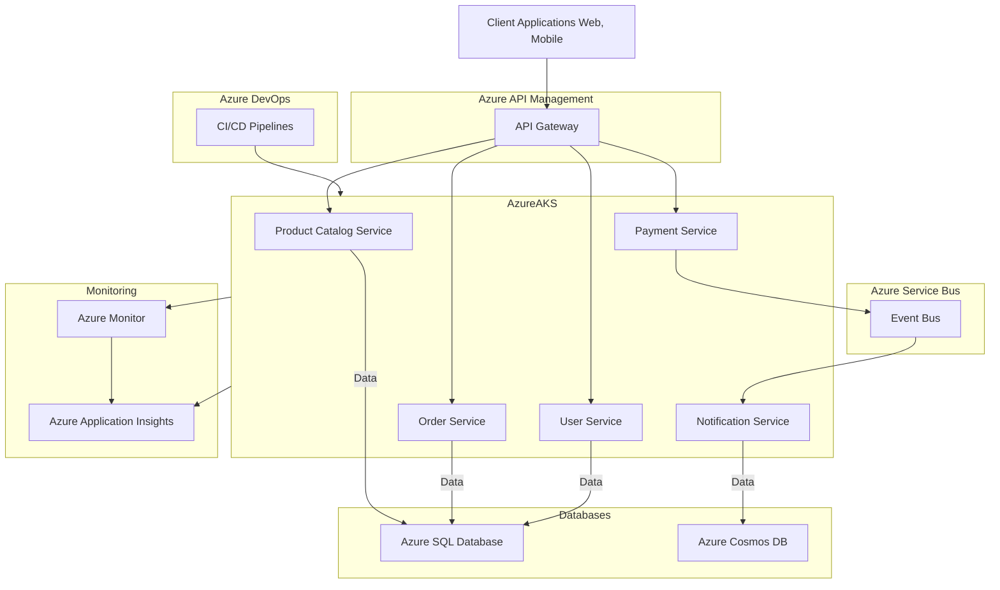
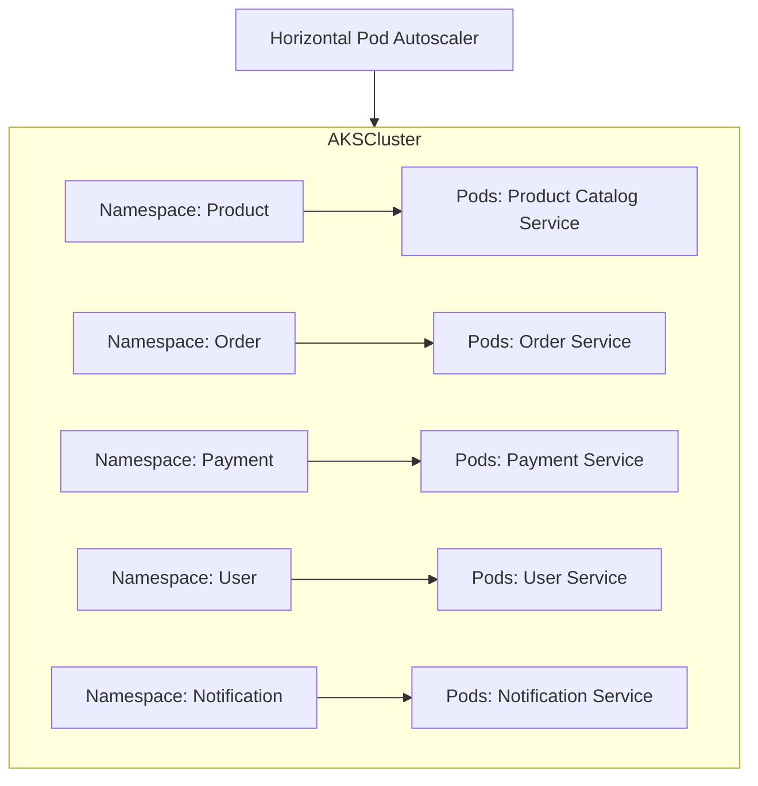
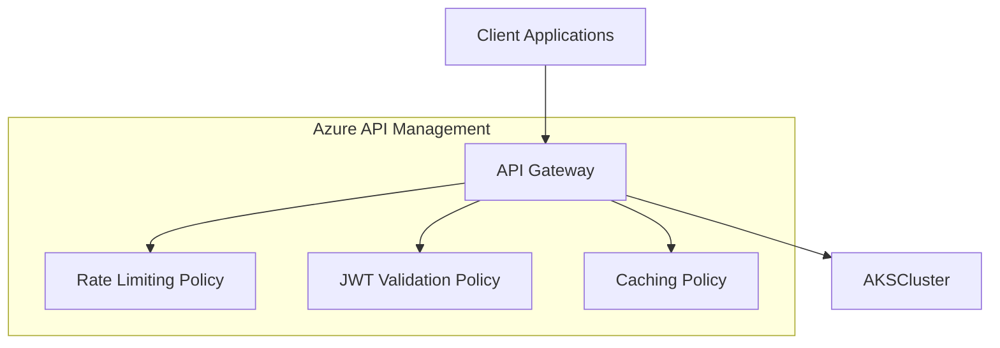
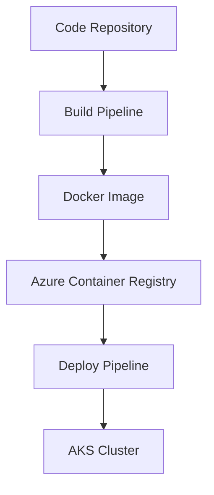
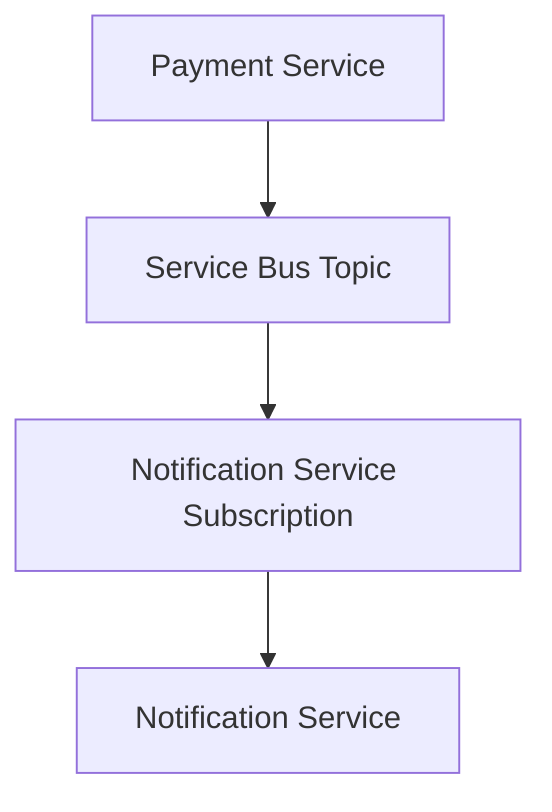
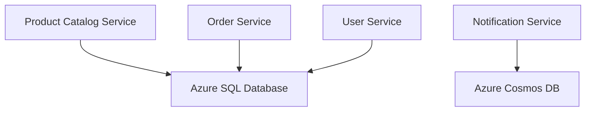
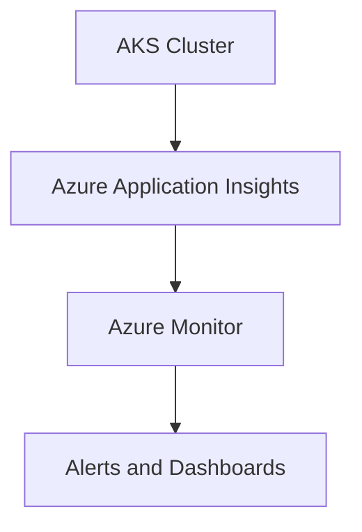
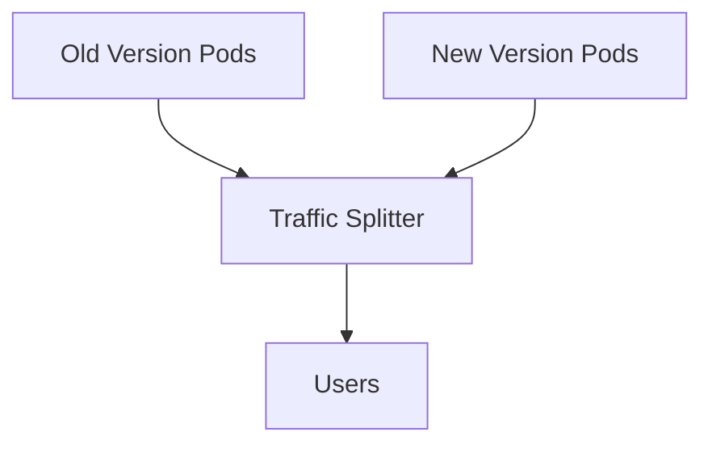
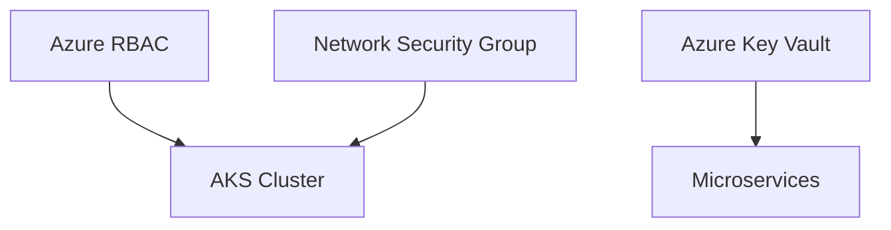
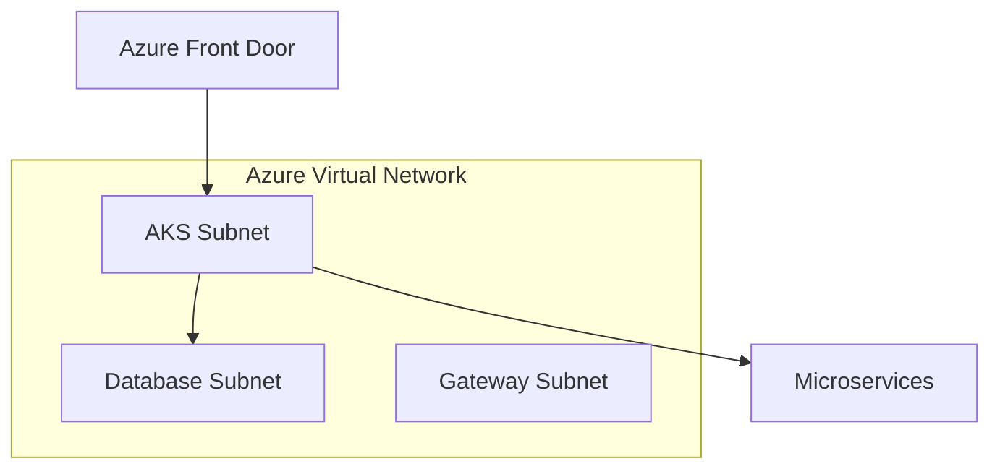

## Microservices and Container-Based Architectures on Azure

Microservices architecture is an approach to developing applications where a large application is built as a suite of small, independently deployable services. Each service is responsible for a specific business capability and communicates with other services through well-defined APIs, often using HTTP/REST, gRPC, or messaging protocols.

Azure offers several services to support microservices and container-based architectures, such as Azure Kubernetes Service (AKS), Azure Service Fabric, Azure Container Instances, Azure API Management, Azure DevOps, Azure Monitor, and more. These services enable developers to build, deploy, scale, and manage microservices in a cost-effective, scalable, and secure manner.

### Use Case: E-Commerce Platform with Microservices

**Scenario**:  
An e-commerce company wants to modernize its application by moving from a monolithic architecture to a microservices-based architecture. The goal is to achieve higher scalability, flexibility in deployments, and the ability to independently develop, test, and deploy features.

The application will consist of several microservices:

1. **Product Catalog Service**: Manages the inventory of products.
2. **Order Service**: Handles order placement, processing, and tracking.
3. **Payment Service**: Manages payment transactions and integrations with payment gateways.
4. **User Service**: Manages user authentication, profiles, and roles.
5. **Notification Service**: Sends notifications (email/SMS) to users for order status updates, promotions, etc.

### Architecture Overview

The microservices architecture for the e-commerce platform on Azure would involve the following components:

1. **Azure Kubernetes Service (AKS)**: The core infrastructure to deploy and manage containerized microservices. Each microservice is deployed as a set of pods managed by Kubernetes.

2. **Azure API Management (APIM)**: Acts as a gateway to expose the microservices securely to external clients and provides features like rate limiting, logging, monitoring, and more.

3. **Azure DevOps**: For continuous integration and continuous deployment (CI/CD) pipelines to automate the build, test, and deployment processes for the microservices.

4. **Azure Service Bus**: A messaging service used to decouple the microservices and provide reliable message delivery.

5. **Azure SQL Database**: A managed relational database service to store data for services like Product Catalog, Order, and User Service.

6. **Azure Cosmos DB**: A NoSQL database service for high-throughput and low-latency data storage, particularly useful for the Notification Service.

7. **Azure Monitor and Azure Application Insights**: For monitoring the health, performance, and availability of the microservices.

### Detailed Mermaid Diagram

Here is a detailed **Mermaid diagram** representing the microservices architecture for the e-commerce platform on Azure:

### Explanation of the Diagram

1. **Client Applications**: Web and mobile clients interact with the microservices through the **API Gateway** hosted on **Azure API Management**.

2. **Azure API Management (APIM)**: Acts as a gateway that routes requests to appropriate microservices deployed in **Azure Kubernetes Service (AKS)**. It handles API security, throttling, caching, and other policies.

3. **Microservices on AKS**:
   - **Product Catalog Service**: Handles requests related to product information and inventory. It stores its data in **Azure SQL Database**.
   - **Order Service**: Manages the order lifecycle (creation, updates, etc.). It stores its data in **Azure SQL Database**.
   - **Payment Service**: Handles payment processing and interacts with external payment gateways. It communicates asynchronously with other services via **Azure Service Bus**.
   - **User Service**: Manages user authentication, profiles, and roles. It stores user data in **Azure SQL Database**.
   - **Notification Service**: Listens to events from **Azure Service Bus** and sends notifications (emails, SMS) to users. It stores notification logs and preferences in **Azure Cosmos DB**.

4. **Databases**:
   - **Azure SQL Database**: A managed SQL database service for structured data related to products, orders, and user management.
   - **Azure Cosmos DB**: A globally distributed NoSQL database used by the **Notification Service** for storing high-volume, low-latency data like notification logs.

5. **Azure DevOps**:
   - **CI/CD Pipelines**: Automates the build, test, and deployment process for each microservice. When code changes are committed, it triggers the pipeline to deploy updated containers to AKS.

6. **Azure Service Bus**:
   - **Event Bus**: Provides reliable and asynchronous messaging between microservices, decoupling services and enabling scalability.

7. **Monitoring and Logging**:
   - **Azure Monitor** and **Azure Application Insights** provide monitoring, logging, and diagnostics for the microservices deployed in AKS, allowing for proactive issue resolution and performance optimization.

### Benefits of This Architecture

- **Scalability**: Each microservice can be independently scaled based on demand.
- **Flexibility**: Different teams can work on different microservices using diverse technology stacks.
- **Resilience**: Failure of one microservice does not affect the entire system; self-healing capabilities in AKS help maintain uptime.
- **DevOps Efficiency**: Automated CI/CD pipelines ensure rapid and reliable deployments.

### 1. Azure Kubernetes Service (AKS)

**Use Case**: Deploying Microservices on AKS for an E-Commerce Platform

Azure Kubernetes Service (AKS) is a managed Kubernetes service that allows you to run containerized applications. It provides capabilities like autoscaling, service discovery, and load balancing. In the e-commerce platform, AKS is used to host all microservices, ensuring high availability, scalability, and self-healing of applications.

**Architecture Details**:
- AKS Cluster hosts multiple microservices in separate namespaces.
- Each microservice is deployed as a set of pods and managed using Kubernetes deployments.
- Horizontal Pod Autoscaler (HPA) is configured to scale the number of pods based on CPU/memory utilization.

**Mermaid Diagram**:

### 2. Azure API Management (APIM)

**Use Case**: Securing and Managing APIs for E-Commerce Microservices

Azure API Management (APIM) acts as a gateway for all the APIs exposed by the microservices. It provides security features, caching, rate limiting, and API monitoring. For the e-commerce platform, APIM ensures that external clients securely access the microservices.

**Architecture Details**:
- APIM manages APIs for each microservice.
- Policies are configured for rate limiting, JWT validation, and caching.
- Logging and monitoring are enabled for API requests.

**Mermaid Diagram**:

### 3. Azure DevOps CI/CD Pipelines

**Use Case**: Continuous Integration and Continuous Deployment for Microservices

Azure DevOps is used to automate the build, test, and deployment of microservices. CI/CD pipelines ensure that every code change is automatically built, tested, and deployed to the AKS cluster.

**Architecture Details**:
- CI pipeline triggers on code commits to the repository, builds Docker images, and pushes them to Azure Container Registry (ACR).
- CD pipeline deploys the images from ACR to the AKS cluster.

**Mermaid Diagram**:

### 4. Azure Service Bus

**Use Case**: Reliable Messaging Between Microservices

Azure Service Bus is a fully managed message broker that provides reliable message delivery between microservices. It is used for decoupling microservices, such as the Payment Service sending order confirmation messages to the Notification Service.

**Architecture Details**:
- Payment Service sends messages to a Service Bus topic.
- Notification Service subscribes to the topic to receive messages asynchronously.

**Mermaid Diagram**:

### 5. Azure SQL Database and Cosmos DB

**Use Case**: Storing Structured and NoSQL Data

Azure SQL Database and Azure Cosmos DB are used to store structured and unstructured data, respectively. The Product Catalog, Order, and User Services use Azure SQL Database, while the Notification Service uses Cosmos DB for storing high-throughput and low-latency data.

**Architecture Details**:
- Azure SQL Database stores relational data for product catalog, orders, and users.
- Azure Cosmos DB stores notification logs and user preferences.

**Mermaid Diagram**:

### 6. Monitoring and Observability with Azure Monitor and Application Insights

**Use Case**: Monitoring Microservices Health and Performance

Azure Monitor and Application Insights provide monitoring and observability for microservices running on AKS. They collect telemetry data to track application health, performance, and availability.

**Architecture Details**:
- Application Insights SDK is integrated into microservices to collect telemetry data.
- Azure Monitor is configured to create alerts and dashboards for proactive monitoring.

**Mermaid Diagram**:

### 7. Deployment Strategies: Blue-Green, Canary, and A/B Deployments

**Use Case**: Safely Deploying New Versions of Microservices

Deployment strategies like Blue-Green, Canary, and A/B are used to deploy new versions of microservices safely. For example, a Canary deployment gradually routes a percentage of traffic to the new version before full rollout.

**Architecture Details**:
- Deploy both old and new versions of a microservice.
- Traffic is gradually shifted from the old version to the new version based on success criteria.

**Mermaid Diagram**:

### 8. Security

**Use Case**: Securing Microservices and Data

Security is a critical component in microservices architecture. It involves securing APIs, data, and network communication. Azure provides tools like RBAC, Network Security Groups (NSGs), Azure Key Vault, and more.

**Architecture Details**:
- Azure RBAC controls access to resources.
- NSGs secure inbound and outbound traffic to AKS nodes.
- Azure Key Vault stores secrets, keys, and certificates securely.

**Mermaid Diagram**:

### 9. Networking and Integration

**Use Case**: Managing Network Traffic and Integration Patterns

Networking involves setting up Virtual Networks (VNets), subnets, ingress/egress traffic management, and integration with services like Azure Front Door for global traffic management.

**Architecture Details**:
- Azure Virtual Network (VNet) contains subnets for AKS and other services.
- Azure Front Door provides global traffic routing and failover for APIs.

**Mermaid Diagram**:

