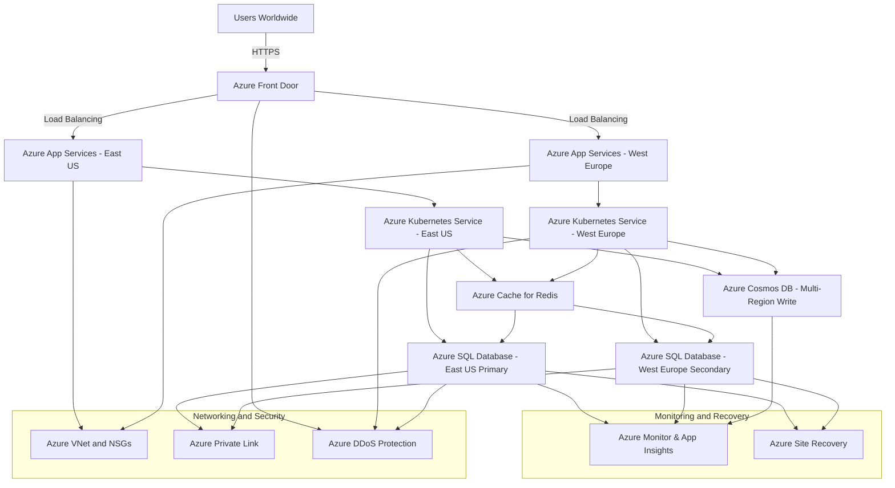
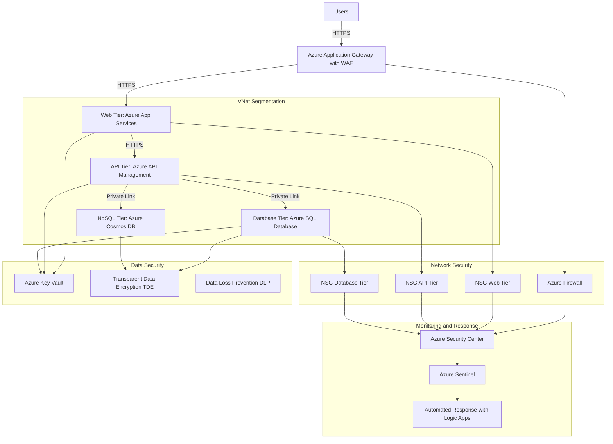
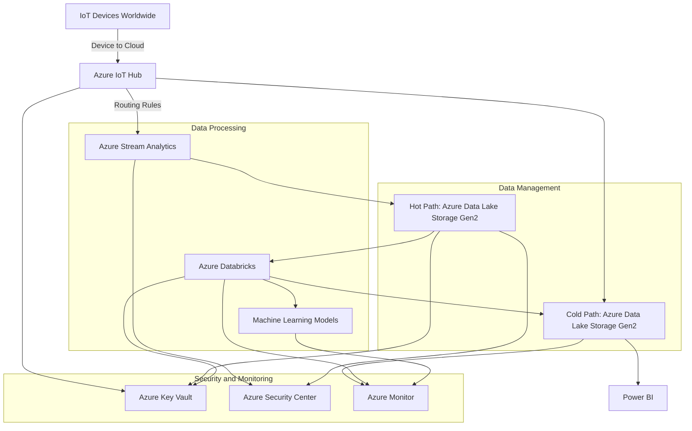
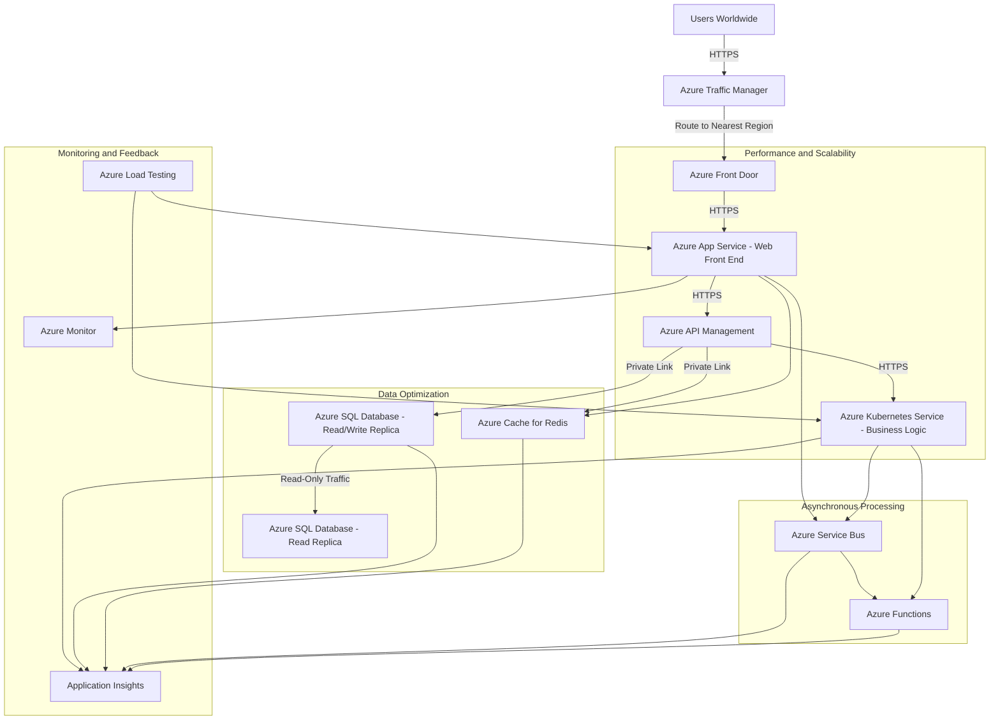
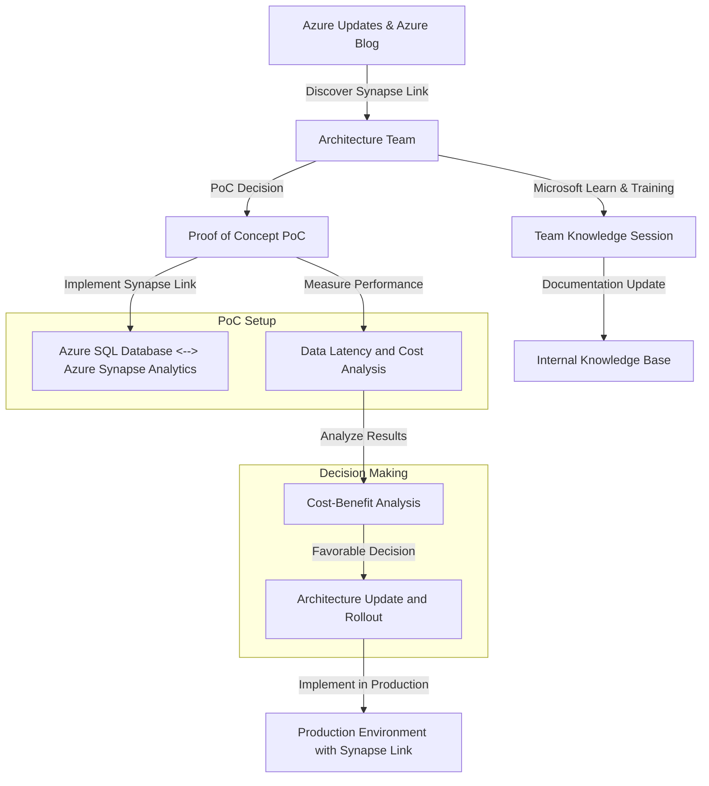
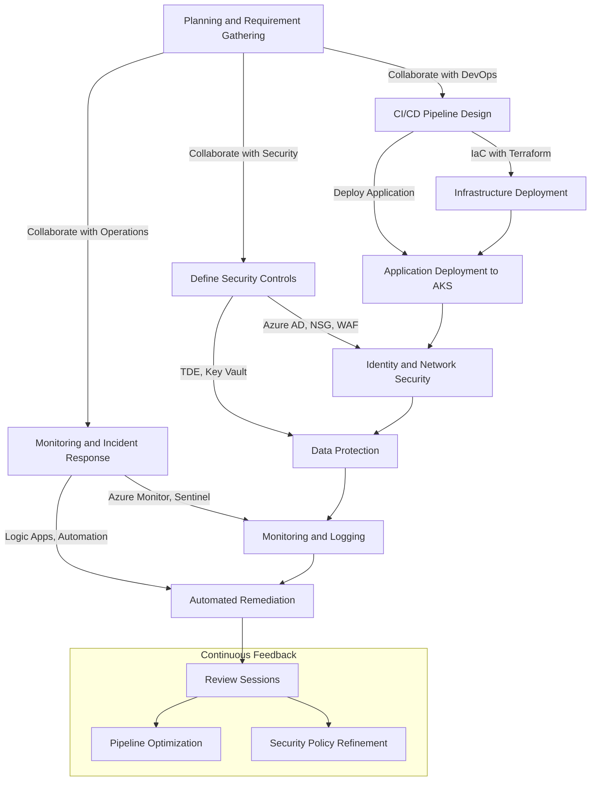

# Azure-Cloud-Architect-Knowledge-Based

### **1. How do you approach translating business requirements into a scalable and cost-effective Azure solution?**
Translating business requirements into a scalable and cost-effective Azure solution involves a structured approach that aligns cloud architecture with business objectives, technical constraints, and operational needs. Here's an expanded explanation of how to approach this process:

### **Approach to Translating Business Requirements into an Azure Solution**

1. **Requirement Gathering and Analysis:**
   - **Understand Business Objectives:** Begin by engaging with stakeholders to understand the core business objectives. Are they looking to reduce costs, increase scalability, enhance performance, improve security, or all of these? Clarify the expected outcomes and KPIs (Key Performance Indicators) to measure success.
   - **Conduct Workshops and Interviews:** Conduct detailed workshops and interviews with business leaders, technical teams, and end-users to gather functional and non-functional requirements. This includes understanding user personas, workflows, data sensitivity, compliance requirements, and the expected growth of users and data.
   - **Identify Constraints and Assumptions:** Document constraints (e.g., budget limits, legacy system dependencies) and assumptions (e.g., expected user growth, transaction volumes) that will impact the solution design.

2. **Define Key Solution Characteristics:**
   - **Performance Requirements:** Determine what performance metrics are critical, such as response time, throughput, and data processing speeds. Use these metrics to select the appropriate Azure services that can meet these performance needs.
   - **Scalability Needs:** Understand both vertical (scale-up) and horizontal (scale-out) scalability requirements. Identify if the application needs to scale automatically based on demand (e.g., using Azure Autoscale for Virtual Machines or Azure Kubernetes Service).
   - **Cost Considerations:** Estimate the total cost of ownership (TCO) by analyzing potential Azure services and resources. Consider compute, storage, network, and operational costs. Look for services that offer flexibility, such as reserved instances, spot VMs, or serverless options that can optimize cost based on workload patterns.
   - **Security and Compliance:** Address any industry-specific compliance needs (e.g., GDPR, HIPAA) and ensure that data encryption, access control, and monitoring are part of the design. Azure services like Azure Key Vault, Azure Policy, and Azure Security Center can be leveraged to enforce security and compliance.
   - **Availability and Resilience:** Define availability requirements, such as SLAs and RPO/RTO (Recovery Point Objective/Recovery Time Objective) for disaster recovery. Use Azure services like Azure Site Recovery, Availability Zones, and Geo-Replication to achieve high availability and resilience.

3. **Choose the Right Azure Services and Architecture Patterns:**
   - **Evaluate Azure Services:** Based on the defined requirements, evaluate which Azure services best meet the needs. For example, choose between Azure App Service, Azure Functions, and Azure Kubernetes Service for hosting applications based on factors like scalability, cost, and management overhead.
   - **Select Architecture Patterns:** Use architecture patterns like microservices, serverless, event-driven, or monolithic based on the application requirements. For example, a highly dynamic, scalable, and loosely-coupled application might benefit from a microservices architecture using Azure Kubernetes Service (AKS) or Azure Functions.
   - **Reference Architectures:** Leverage Azure's Reference Architectures from the Azure Architecture Center to guide the solution design. These references provide best practices for designing secure, high-performing, and cost-effective architectures.
   
4. **Design the Solution Architecture:**
   - **Create Architecture Diagrams:** Develop high-level architecture diagrams that outline the major components and their interactions. Include details on networking, data flow, compute resources, storage solutions, and security layers.
   - **Detailed Design Components:** Break down the high-level architecture into detailed designs for each component, such as API management, data storage, authentication, and integration points.
   - **Consider Multi-Region and Multi-Availability Zone Deployments:** For critical applications requiring high availability and low latency, consider deploying resources across multiple Azure regions and leveraging services like Azure Traffic Manager and Azure Front Door for traffic routing and load balancing.

5. **Optimize for Cost and Efficiency:**
   - **Right-Size Resources:** Use Azure Cost Management and Azure Advisor to analyze and right-size resources, ensuring the solution remains cost-effective without compromising performance.
   - **Serverless and Consumption-Based Models:** Consider serverless options like Azure Functions and Logic Apps where workloads are event-driven or have unpredictable patterns. This can significantly reduce costs since you only pay for what you use.
   - **Reserved Instances and Spot VMs:** For predictable workloads, leverage reserved instances for Virtual Machines (VMs) to gain cost savings over pay-as-you-go pricing. Use spot VMs for non-critical, interruptible workloads to further optimize costs.

6. **Implement DevOps Practices:**
   - **Infrastructure as Code (IaC):** Use tools like Azure Resource Manager (ARM) templates, Bicep, or Terraform to define and manage infrastructure as code. This ensures consistent deployments across environments and makes the infrastructure easily repeatable.
   - **CI/CD Pipeline Setup:** Set up CI/CD pipelines using Azure DevOps or GitHub Actions to automate the deployment process, enabling quick iterations, testing, and delivery. This reduces time-to-market and helps in maintaining code quality and consistency.

7. **Develop a Proof of Concept (PoC):**
   - **Build a Prototype:** Develop a PoC to validate the architecture, assess the performance, and understand potential challenges. This helps in fine-tuning the design before full-scale implementation.
   - **Collect Feedback:** Gather feedback from stakeholders, technical teams, and end-users on the PoC to ensure it meets expectations and make adjustments as needed.

8. **Implement Monitoring, Logging, and Management:**
   - **Monitoring and Observability:** Set up monitoring using Azure Monitor, Application Insights, and Log Analytics to ensure the solution operates as expected. Implement alerts for critical metrics to proactively manage issues.
   - **Management and Governance:** Use Azure Policy, Azure Blueprints, and Azure Management Groups to enforce governance and maintain compliance across the Azure environment.

9. **Create Documentation and Training Materials:**
   - **Documentation:** Provide detailed documentation for architecture, configuration, operational procedures, and disaster recovery plans to ensure smooth handover to the operations team.
   - **Training:** Conduct training sessions for the client's technical teams to familiarize them with the new Azure environment, tools, and best practices.

10. **Continuous Improvement:**
    - **Regular Review and Optimization:** Continuously monitor and review the solution post-implementation, leveraging tools like Azure Advisor and Azure Cost Management to identify potential optimizations in performance, security, and cost.

### **Example Use Case: Building a Scalable E-Commerce Platform**

1. **Business Requirement:** An e-commerce company wants to build a new platform that can scale during peak shopping seasons, is secure, and cost-effective, and provides high availability.
   
2. **Proposed Azure Solution:**
   - **Web Front End:** Use Azure App Service with autoscaling enabled for the web front end to handle variable traffic loads.
   - **Data Storage:** Utilize Azure SQL Database with geo-replication for transactional data and Azure Cosmos DB for high-speed, globally distributed NoSQL data.
   - **Caching Layer:** Implement Azure Cache for Redis to improve application performance by caching frequently accessed data.
   - **Data Analytics:** Use Azure Synapse Analytics for real-time data processing and analytics to provide insights into customer behavior and sales trends.
   - **Security and Compliance:** Azure Key Vault for secrets management, Azure Security Center for monitoring and threat detection, and Azure Policy for compliance enforcement.
   - **Monitoring and Management:** Use Azure Monitor, Application Insights, and Log Analytics for complete observability.

3. **Outcome:** The architecture is designed to be scalable, secure, and cost-effective, capable of handling peak loads with minimal downtime and reduced operational costs.

By following this structured approach, you can effectively translate business requirements into a scalable, secure, and cost-effective Azure solution that meets both current and future business needs.

### **2. Can you describe a time when you had to design an Azure architecture to meet strict performance and reliability requirements?**

Designing an Azure architecture to meet strict performance and reliability requirements involves careful planning, selecting appropriate Azure services, and implementing best practices to ensure high availability, low latency, and fault tolerance. This often includes leveraging Azure’s built-in capabilities for scalability, redundancy, and disaster recovery.

### **Approach to Designing an Azure Architecture for Performance and Reliability**

When designing such an architecture, the following steps are typically involved:

1. **Understand Requirements:**
   - **Performance Requirements:** Determine the performance metrics such as response times, transaction throughput, and latency requirements. Understand the expected load and peak traffic patterns.
   - **Reliability Requirements:** Define SLAs (Service Level Agreements), availability targets (e.g., 99.9% uptime), and disaster recovery objectives (RPO - Recovery Point Objective, RTO - Recovery Time Objective).

2. **Choose the Right Azure Services:**
   - Select Azure services that provide the required performance and reliability, such as Azure SQL Database with geo-replication, Azure Virtual Machines with Availability Sets or Availability Zones, and Azure Front Door or Traffic Manager for global load balancing.

3. **Design for High Availability and Fault Tolerance:**
   - Implement redundancy at all levels (compute, network, data, etc.) to avoid single points of failure.
   - Use multiple Availability Zones and Regions for critical workloads to ensure resiliency.

4. **Implement Scalability and Performance Optimization:**
   - Use Azure Autoscale, Azure Load Balancer, and Azure Cache for Redis to handle variable workloads and optimize performance.
   - Optimize data storage and retrieval using caching strategies, read replicas, and appropriate indexing.

5. **Ensure Security and Compliance:**
   - Incorporate security best practices, such as using Azure Key Vault for secrets management, Azure DDoS Protection, and network security controls like NSGs and ASGs.

6. **Monitor and Optimize Continuously:**
   - Implement Azure Monitor, Azure Application Insights, and Azure Log Analytics for monitoring, alerting, and optimizing the performance and reliability of the architecture.

### **Use Case: High-Performance and Reliable E-Commerce Platform**

**Scenario:**
A global e-commerce company wants to build a highly reliable and performant platform on Azure to support millions of users worldwide. The platform must handle peak loads during seasonal sales, ensure data integrity, provide high availability, and meet an SLA of 99.99%.

#### **Key Requirements:**
- **Performance:** The platform must handle thousands of concurrent transactions with low latency (under 200 ms response time).
- **Reliability:** Must have a multi-region deployment with an SLA of 99.99%.
- **Scalability:** Automatic scaling to handle traffic spikes during sales events.
- **Security:** Secure data handling and compliance with GDPR and other regulatory standards.
- **Disaster Recovery:** RPO of 15 minutes and RTO of 30 minutes.

#### **Architecture Design:**

1. **Frontend Layer:**
   - **Azure Front Door:** Used for global load balancing, SSL offloading, and fast content delivery. It directs user traffic to the nearest backend region and provides application layer security with WAF (Web Application Firewall).
   - **Azure CDN (Content Delivery Network):** For caching static content to reduce latency and offload traffic from the web servers.

2. **Application Layer:**
   - **Azure App Services (Web Apps):** Deployed in multiple regions (East US and West Europe) for hosting the e-commerce web application. The web apps are configured with autoscaling to handle traffic surges.
   - **Azure Kubernetes Service (AKS):** Hosts microservices for business logic with autoscaling and self-healing capabilities. AKS clusters are deployed in different regions with cluster autoscaling enabled.

3. **Data Layer:**
   - **Azure SQL Database with Geo-Replication:** Provides a managed relational database service with read replicas in secondary regions for high availability and disaster recovery.
   - **Azure Cosmos DB:** For globally distributed, low-latency NoSQL data storage with multi-region write capabilities.
   - **Azure Cache for Redis:** Provides in-memory caching to reduce database load and improve read performance.

4. **Networking and Security:**
   - **Azure Virtual Network (VNet):** Segregates the application, data, and management subnets with Network Security Groups (NSGs) to control traffic flow.
   - **Azure Private Link:** Used for secure connections between services within the Azure network.
   - **Azure DDoS Protection Standard:** Provides enhanced DDoS mitigation features to protect the application from volumetric attacks.

5. **Monitoring and Incident Management:**
   - **Azure Monitor and Application Insights:** For end-to-end monitoring, logging, and telemetry of application performance and availability.
   - **Azure Log Analytics:** Centralized logging and query capabilities for proactive monitoring and troubleshooting.

6. **Backup and Disaster Recovery:**
   - **Azure Site Recovery:** Configured for orchestrating failover between regions, ensuring an RTO of 30 minutes.
   - **Automated Backups:** Regular backups are configured for both Azure SQL Database and Azure Cosmos DB to ensure data availability with an RPO of 15 minutes.

#### **Mermaid Diagram for the High-Performance and Reliable E-Commerce Platform:**



### **Key Components in the Diagram:**

- **Users Worldwide:** Represents end-users accessing the e-commerce platform globally.
- **Azure Front Door:** Provides global load balancing, SSL offloading, WAF protection, and traffic routing to the nearest Azure region.
- **Azure App Services (East US, West Europe):** The front-end layer of the e-commerce platform hosted on Azure App Services with autoscaling.
- **Azure Kubernetes Service (East US, West Europe):** Manages the microservices architecture for business logic processing with autoscaling.
- **Azure SQL Database with Geo-Replication:** Ensures data availability and redundancy across regions for the relational database.
- **Azure Cosmos DB:** Provides globally distributed NoSQL data storage with low-latency and high-availability guarantees.
- **Azure Cache for Redis:** In-memory caching layer for improved read performance and reduced load on the SQL Database.
- **Networking and Security:** Azure VNet for network isolation, NSGs for traffic control, Private Link for secure service connectivity, and DDoS Protection for enhanced security.
- **Monitoring and Recovery:** Azure Monitor and Application Insights for observability and alerting, and Azure Site Recovery for orchestrating disaster recovery.

### **Outcome:**

By implementing this Azure architecture, the e-commerce platform can meet the strict performance and reliability requirements:

- **High Availability:** Achieved through multi-region deployment, geo-replication, and redundancy across all layers.
- **Scalability:** Auto-scaling capabilities in Azure App Services and AKS allow the platform to handle traffic spikes seamlessly.
- **Performance:** Low-latency global load balancing with Azure Front Door and fast data access using Azure Cache for Redis and Cosmos DB.
- **Security and Compliance:** Enhanced security with Azure DDoS Protection, Private Link, NSGs, and compliance with regulatory standards.
- **Disaster Recovery:** Meets RPO and RTO targets using Azure Site Recovery and automated backups.

This architecture ensures that the platform is resilient, scalable, and performant, capable of handling millions of users globally with a reliable and secure cloud foundation.


### **3. How do you ensure that your Azure solutions adhere to best practices in security?**
Ensuring that Azure solutions adhere to **best practices in security** involves implementing a comprehensive, multi-layered security approach to protect resources, data, and applications from potential threats. This approach is often called **defense-in-depth**, where security controls are layered to provide redundancy in the event of a failure or breach at any one level. Below is an expanded discussion on how to achieve this, followed by a use case and a corresponding Mermaid diagram.

### **Approach to Ensuring Security Best Practices in Azure Solutions**

To ensure that Azure solutions adhere to best practices in security, the following key strategies should be implemented:

1. **Identity and Access Management (IAM):**
   - Use **Azure Active Directory (Azure AD)** for centralized identity management and single sign-on (SSO) across Azure and third-party applications.
   - Implement **Multi-Factor Authentication (MFA)** for all users, especially for privileged accounts, to add an additional layer of security.
   - Utilize **Role-Based Access Control (RBAC)** to grant the least privilege necessary for users and services, ensuring that only authorized personnel have access to sensitive resources.
   - Enable **Privileged Identity Management (PIM)** to manage, control, and monitor access to important resources in Azure AD and Azure.

2. **Network Security:**
   - **Network Security Groups (NSGs)**: Control inbound and outbound traffic to Azure resources within a Virtual Network (VNet).
   - **Azure Firewall**: Implement a stateful firewall to provide centralized network security policies and log all traffic.
   - **Web Application Firewall (WAF)**: Protect web applications from common web vulnerabilities, such as SQL injection and cross-site scripting (XSS).
   - **Virtual Network Service Endpoints** and **Private Link**: Securely extend your network to Azure services, keeping traffic on the Azure backbone.

3. **Data Security:**
   - **Encryption**: Ensure data is encrypted at rest and in transit using **Azure Storage Service Encryption (SSE)**, **Transparent Data Encryption (TDE)** for Azure SQL Database, and **Azure Disk Encryption** for VMs.
   - Use **Azure Key Vault** to manage secrets, encryption keys, and certificates securely, ensuring data remains protected.
   - Implement **Data Loss Prevention (DLP)** and **Azure Information Protection** to classify, label, and protect sensitive data.

4. **Application Security:**
   - **Secure DevOps** practices: Integrate security early in the development lifecycle with tools like **Azure DevOps** and **GitHub Actions** for CI/CD.
   - Use **Managed Identities** for Azure resources to avoid embedding credentials in code and to securely authenticate against Azure services.
   - Conduct regular vulnerability assessments and penetration testing using **Azure Security Center** and integrate security scans into CI/CD pipelines.

5. **Monitoring and Incident Response:**
   - **Azure Monitor**, **Azure Sentinel**, and **Azure Security Center**: Implement these for continuous monitoring, threat detection, incident response, and compliance management.
   - Automate incident response using **Azure Logic Apps**, **Azure Automation**, or **Azure Functions** to reduce response times to security events.

6. **Governance and Compliance:**
   - **Azure Policy**: Enforce organizational policies and compliance requirements across all resources, ensuring resources are configured consistently and securely.
   - **Azure Blueprints**: Deploy a set of Azure resources that adhere to your organization’s standards, patterns, and requirements in a repeatable manner.
   - **Azure Resource Locks**: Prevent accidental deletion or modification of critical resources by implementing read-only or delete locks.

### **Use Case: Securing a Multi-Cloud Application on Azure**

**Scenario:**
A healthcare organization needs to deploy a multi-cloud patient management application that adheres to strict security and compliance requirements, such as HIPAA in the United States. The application must securely handle sensitive patient data, ensure high availability, and be resilient against potential cyber-attacks.

#### **Key Security Requirements:**
- **Data Protection:** All sensitive patient data must be encrypted both at rest and in transit.
- **Access Control:** Only authorized personnel and applications should have access to sensitive resources.
- **Compliance:** The solution must comply with HIPAA regulations, which require strong access controls, auditing, and data protection.
- **Incident Response:** The organization must have capabilities for detecting and responding to security threats in real time.

#### **Azure Security Solution Design:**

1. **Identity and Access Management (IAM):**
   - **Azure Active Directory (Azure AD):** Set up centralized identity management with Azure AD. All users and applications authenticate using Azure AD. Implement **Conditional Access Policies** to enforce MFA, restrict access based on location or risk, and ensure compliance with security requirements.
   - **Role-Based Access Control (RBAC):** Use RBAC to limit access to Azure resources based on user roles (e.g., doctors, nurses, administrators) and apply the principle of least privilege.
   - **Privileged Identity Management (PIM):** Implement PIM to provide just-in-time access for privileged roles, with automatic logging and alerting on all elevated access activities.

2. **Network Security:**
   - **Virtual Network (VNet) Segmentation:** Deploy the application components in a segmented VNet structure:
     - **Web Subnet:** Hosts the front-end web application behind an **Azure Application Gateway** with **WAF** enabled.
     - **API Subnet:** Hosts the middle-tier API services that only accept traffic from the Web Subnet.
     - **Database Subnet:** Hosts the backend Azure SQL Database and Cosmos DB instances, accessible only by the API subnet.
   - **Azure Firewall:** A centralized Azure Firewall is deployed to manage and monitor all traffic flowing between the subnets and to and from the internet.
   - **Private Link and Service Endpoints:** Secure access to Azure services (like Azure SQL Database and Azure Storage) using Private Link, keeping traffic within the Azure backbone network.

3. **Data Security:**
   - **Transparent Data Encryption (TDE):** Enabled for Azure SQL Database to encrypt data at rest automatically.
   - **Azure Key Vault:** Used for managing secrets, certificates, and encryption keys. Keys are rotated regularly, and access is tightly controlled using Azure AD identities and RBAC.
   - **Data Loss Prevention (DLP):** Configured to detect, monitor, and protect sensitive information from unauthorized access or sharing.

4. **Application Security:**
   - **Managed Identities:** The application uses **Managed Identities** to access Azure resources like Key Vault and Azure SQL Database, eliminating the need for storing credentials in the codebase.
   - **Secure DevOps Practices:** Integrated **Azure DevOps** pipelines with security checks and code scanning tools (like **SonarQube** or **Checkmarx**) to ensure vulnerabilities are identified and mitigated early in the development lifecycle.

5. **Monitoring and Incident Response:**
   - **Azure Security Center and Azure Sentinel:** Implement these for continuous security posture monitoring, vulnerability assessment, and advanced threat detection with AI and machine learning capabilities.
   - **Automated Response:** Use **Azure Logic Apps** to automate incident response workflows, such as isolating a compromised VM or revoking access from a potentially compromised user account.

6. **Governance and Compliance:**
   - **Azure Policy and Blueprints:** Deploy **Azure Blueprints** tailored for HIPAA compliance, which includes required policies, role assignments, and resource configurations.
   - **Resource Locks:** Critical resources like Azure SQL Database and Key Vault are protected with delete locks to prevent accidental deletion.

#### **Mermaid Diagram for the Secured Multi-Cloud Healthcare Application Architecture:**

Here’s a Mermaid diagram to illustrate the security architecture:



### **Key Components in the Diagram:**

- **Users:** Represent end-users accessing the patient management application.
- **Azure Application Gateway with WAF:** Provides web application firewall protection and SSL offloading for incoming HTTPS traffic.
- **Web Tier (Azure App Services):** Hosts the front-end web application within a segmented VNet.
- **API Tier (Azure API Management):** Manages API access, rate limiting, and caching for back-end services.
- **Database Tier (Azure SQL Database):** Stores sensitive patient data securely with encryption and private link connectivity.
- **NoSQL Tier (Azure Cosmos DB):** Stores unstructured data with globally distributed capabilities.
- **Network Security:** Azure Firewall and NSGs to manage and monitor network traffic between subnets.
- **Data Security:** Azure Key Vault for managing secrets, Transparent Data

 Encryption (TDE) for encrypting data at rest, and Data Loss Prevention (DLP) to protect sensitive data.
- **Monitoring and Response:** Azure Security Center, Azure Sentinel for advanced threat detection, and automated incident response using Logic Apps.

### **Outcome:**

By implementing this comprehensive Azure architecture with a strong focus on security best practices, the healthcare organization ensures:

- **Data Security and Compliance:** Meets stringent HIPAA requirements for data encryption, access control, and auditing.
- **Identity and Access Management:** Centralized and secure identity management with Azure AD, MFA, RBAC, and PIM.
- **Network Security:** Robust network segmentation, traffic filtering, and protection against web-based attacks.
- **Threat Detection and Response:** Real-time monitoring, automated threat detection, and incident response to minimize risks.
- **Operational Efficiency:** Secure DevOps practices and automation reduce manual intervention and improve deployment consistency.

This architecture demonstrates how Azure’s security services and best practices can be leveraged to build a secure, compliant, and robust cloud solution for handling sensitive data in regulated industries.
### **4. Can you walk us through how you would develop architecture blueprints and documentation for a new Azure project?**
Developing architecture blueprints and documentation for a new Azure project is a crucial part of planning and designing cloud solutions. The architecture blueprint serves as a roadmap, outlining the key components, services, and integrations that form the backbone of the solution. Effective documentation ensures that stakeholders across development, operations, security, and management teams understand the architecture, its components, and the rationale behind design decisions.

### **Approach to Developing Architecture Blueprints and Documentation for a New Azure Project**

When developing architecture blueprints and documentation for a new Azure project, the following structured approach is generally taken:

1. **Requirements Gathering and Analysis:**
   - **Business Requirements:** Understand the business objectives, key use cases, and desired outcomes. Identify what success looks like for the project.
   - **Technical Requirements:** Define performance, scalability, security, compliance, availability, and disaster recovery requirements.
   - **Constraints:** Identify any constraints, such as budget limits, existing dependencies, or compliance regulations that impact the architecture.

2. **Define Solution Scope and Architecture Objectives:**
   - Define the scope of the solution, including the core components, data flows, and integration points.
   - Establish architecture objectives such as high availability, fault tolerance, scalability, security, cost optimization, and ease of maintenance.

3. **Create High-Level Architecture Blueprint:**
   - Develop a high-level architecture diagram to illustrate the main components and their interactions.
   - Identify the core Azure services required (e.g., Azure Virtual Machines, Azure SQL Database, Azure App Services, Azure Kubernetes Service) and how they interconnect.

4. **Detailed Design for Each Component:**
   - Break down the high-level architecture into detailed designs for each component, such as compute, storage, networking, security, and monitoring.
   - Provide detailed specifications like VM sizes, storage configurations, network security settings, data replication strategies, etc.

5. **Deployment and Configuration Documentation:**
   - Develop step-by-step guides and scripts using **Infrastructure as Code (IaC)** tools like **Azure Resource Manager (ARM) templates**, **Bicep**, **Terraform**, or **PowerShell**.
   - Include detailed deployment processes, parameter files, environment configurations, and dependency management.

6. **Operational Documentation:**
   - Create runbooks and documentation for day-to-day operations, such as monitoring, alerting, backup, and disaster recovery procedures.
   - Document troubleshooting steps, common issues, and maintenance schedules.

7. **Review and Validation with Stakeholders:**
   - Conduct design reviews with stakeholders to validate that the architecture meets business and technical requirements.
   - Perform proof-of-concept (PoC) testing to validate that the architecture meets performance, scalability, and security needs.

8. **Finalize and Maintain Documentation:**
   - Finalize the architecture blueprints and documentation, ensuring they are stored in a version-controlled repository (e.g., Azure DevOps, GitHub).
   - Establish a process for updating and maintaining the documentation as the solution evolves.

### **Use Case: Developing Architecture Blueprints for a Scalable IoT Analytics Platform on Azure**

**Scenario:**
A manufacturing company wants to develop an IoT analytics platform on Azure to monitor and analyze data from thousands of IoT devices deployed in their factories worldwide. The platform must be scalable, secure, and capable of providing near real-time insights to optimize operations, predict maintenance needs, and reduce downtime.

#### **Key Requirements:**
- **Scalability:** The platform must handle data ingestion from up to 100,000 IoT devices with variable data rates.
- **Performance:** Provide near real-time analytics and visualization.
- **Security and Compliance:** Secure IoT device data and ensure compliance with regional data protection regulations (e.g., GDPR).
- **High Availability and Disaster Recovery:** Ensure 99.9% uptime and minimal data loss in case of failure.

#### **Architecture Design Steps:**

1. **High-Level Architecture Blueprint:**
   - The architecture consists of five layers: **Data Ingestion**, **Storage**, **Processing**, **Analytics and Visualization**, and **Management and Security**.

   - **Key Components:**
     - **Data Ingestion:** Azure IoT Hub for secure and scalable device-to-cloud communication.
     - **Storage:** Azure Data Lake Storage (ADLS) Gen2 for raw and processed data storage.
     - **Processing:** Azure Stream Analytics for real-time processing and Azure Databricks for batch processing and machine learning.
     - **Analytics and Visualization:** Power BI for real-time dashboards and reporting.
     - **Management and Security:** Azure Monitor, Azure Security Center, and Azure Policy for monitoring, security, and compliance management.

2. **Detailed Design Documentation:**
   - **Data Ingestion Layer:** Configure Azure IoT Hub with device provisioning service (DPS) for auto-provisioning and scaling. Document routing rules to send data to different endpoints for hot and cold paths.
   - **Storage Layer:** Use Azure Data Lake Storage Gen2 for both raw data (cold path) and processed data (hot path). Set up access controls (RBAC) and data lifecycle policies for cost management.
   - **Processing Layer:** Implement Azure Stream Analytics jobs for real-time processing of IoT data streams. Use Azure Databricks with Delta Lake for batch processing and advanced analytics.
   - **Analytics and Visualization Layer:** Define Power BI datasets, reports, and dashboards to visualize real-time and historical data.
   - **Management and Security Layer:** Document integration with Azure Monitor and Log Analytics for monitoring and alerting. Use Azure Security Center for continuous security posture management.

3. **Deployment and Configuration Documentation:**
   - **Terraform Example for Azure IoT Hub Deployment:**
     ```terraform
     resource "azurerm_iothub" "example" {
       name                = "iot-hub-example"
       resource_group_name = azurerm_resource_group.example.name
       location            = azurerm_resource_group.example.location
       sku {
         name     = "S1"
         capacity = 2
       }
       tags = {
         environment = "production"
       }
     }
     ```
   - Document step-by-step instructions for deploying each component using Terraform, ARM templates, or Bicep.

4. **Operational Documentation:**
   - **Monitoring and Alerting:** Use Azure Monitor to set up alerts for critical events such as IoT Hub message throttling, data processing failures, or storage capacity issues.
   - **Backup and Disaster Recovery:** Document backup strategies for Azure Data Lake Storage using snapshots and geo-redundancy.

5. **Review and Validation:**
   - Conduct architecture review sessions with stakeholders from IoT, data engineering, security, and business teams.
   - Validate the architecture with a proof-of-concept to ensure it meets performance, scalability, and security requirements.

6. **Finalize and Maintain Documentation:**
   - Store all architecture blueprints, deployment scripts, and operational guides in a centralized version-controlled repository.
   - Schedule regular review cycles to update the documentation as the solution evolves and new features are added.

#### **Mermaid Diagram for the Scalable IoT Analytics Platform Architecture:**

Here’s a Mermaid diagram that illustrates the architecture for the Azure IoT Analytics Platform:



### **Key Components in the Diagram:**

- **IoT Devices Worldwide:** Represents IoT sensors and devices deployed globally, sending telemetry data to Azure.
- **Azure IoT Hub:** Central service for secure device-to-cloud communication, managing millions of devices.
- **Azure Stream Analytics:** Real-time processing engine for the hot path, analyzing incoming data streams and writing results to Azure Data Lake Storage Gen2.
- **Azure Data Lake Storage Gen2 (Hot and Cold Paths):** Centralized storage for both raw and processed IoT data. Raw data is stored in the cold path for future processing, and processed data is stored in the hot path for real-time analysis.
- **Azure Databricks:** Performs batch processing, data transformation, and machine learning. Reads from the hot path and writes back to the cold path.
- **Power BI:** Visualization and reporting tool for real-time and historical data insights.
- **Security and Monitoring:** Includes Azure Key Vault for secrets management, Azure Security Center for security monitoring, and Azure Monitor for performance monitoring and alerts.

### **Outcome:**

By developing comprehensive architecture blueprints and documentation for the IoT analytics platform, the manufacturing company ensures that:

- **Scalability:** The solution can handle a large number of IoT devices and variable data rates.
- **Performance:** Near real-time processing and analytics provide actionable insights to optimize operations.
- **Security and Compliance:** Secure device communication, data encryption, and adherence to regulatory standards ensure robust security.
- **Operational Efficiency:** Detailed deployment and operational guides enable smooth implementation, monitoring, and maintenance.

This approach provides a well-documented, scalable, and secure architecture that meets the business and technical requirements of deploying an IoT analytics platform on Azure.
### **5. How do you approach code reviews and performance optimizations in Azure-based projects?**
Approaching **code reviews** and **performance optimizations** in Azure-based projects is critical to ensuring that applications are efficient, secure, scalable, and maintainable. Code reviews help identify potential issues early, enforce coding standards, and encourage best practices, while performance optimizations focus on enhancing the efficiency and speed of applications to meet business and technical requirements.

### **Approach to Code Reviews and Performance Optimizations in Azure-Based Projects**

1. **Establish Code Review Guidelines:**
   - **Define Standards:** Set coding standards and guidelines, including naming conventions, error handling, logging, security best practices, and performance optimization techniques. Ensure these standards are well-documented and accessible to all team members.
   - **Automated Code Analysis:** Use tools like **SonarQube**, **ESLint**, **StyleCop**, or **PSScriptAnalyzer** in CI/CD pipelines to automate code quality checks and enforce coding standards.
   - **Review Process:** Implement a structured code review process in tools like **Azure Repos**, **GitHub**, or **GitLab**. Reviews should focus on functionality, performance, security, readability, maintainability, and scalability.
   - **Peer Reviews and Pair Programming:** Encourage peer reviews or pair programming to share knowledge, improve code quality, and reduce errors.

2. **Performance Optimization Techniques:**
   - **Resource Sizing and Scaling:** Right-size Azure resources like VMs, Azure SQL Databases, and AKS nodes to optimize costs and performance. Use auto-scaling to handle variable workloads efficiently.
   - **Caching and CDN:** Use caching (e.g., **Azure Cache for Redis**) to reduce the load on databases and improve application response times. Leverage **Azure CDN** for content delivery to reduce latency.
   - **Data Optimization:** Optimize database queries, indexes, and data storage strategies. Consider using **read replicas** or **partitioning** for large datasets.
   - **Asynchronous Processing:** Implement asynchronous processing using **Azure Functions**, **Azure Logic Apps**, or **Azure Service Bus** to offload long-running tasks.
   - **Network Optimization:** Optimize network latency and bandwidth usage by configuring **Azure Traffic Manager**, **Azure Front Door**, and **Virtual Network (VNet) Peering**.

3. **Monitoring and Profiling:**
   - **Azure Monitor and Application Insights:** Use **Azure Monitor** and **Azure Application Insights** for end-to-end monitoring of application performance, identifying bottlenecks, and generating alerts.
   - **Profiling Tools:** Utilize profiling tools like **Azure Performance Profiler**, **SQL Query Performance Insights**, and **Azure Diagnostics** to analyze code performance and identify optimization opportunities.

4. **Continuous Feedback and Improvement:**
   - **Regular Retrospectives:** Conduct regular retrospectives after each sprint or release to review the effectiveness of code reviews and optimization efforts.
   - **Performance Testing:** Integrate performance testing tools like **Azure Load Testing**, **Apache JMeter**, or **k6** in the CI/CD pipeline to validate performance improvements.
   - **Knowledge Sharing:** Encourage knowledge sharing and training sessions on code optimization, Azure best practices, and tool usage.

### **Use Case: Optimizing a High-Traffic E-Commerce Application on Azure**

**Scenario:**
An e-commerce company has a web application hosted on Azure that experiences high traffic during sales events, resulting in performance degradation and slow response times. The company wants to optimize the application to handle peak loads, reduce response times, and ensure a smooth user experience.

#### **Key Requirements:**
- **Performance:** The application must handle thousands of concurrent users with a response time of under 200 ms.
- **Scalability:** Auto-scale resources to handle traffic spikes during sales events.
- **Cost Optimization:** Minimize costs by right-sizing resources and using efficient Azure services.
- **Reliability:** Ensure high availability and fault tolerance to handle unexpected failures.

#### **Approach to Code Reviews and Performance Optimization:**

1. **Code Review Guidelines:**
   - Established code review guidelines that include:
     - **Security Best Practices:** Ensure no hard-coded secrets, use managed identities, and validate input/output to prevent SQL injection and XSS attacks.
     - **Performance Checks:** Identify and refactor inefficient code patterns, such as N+1 queries, excessive database calls, and redundant computations.
     - **Error Handling and Logging:** Ensure proper error handling and structured logging for debugging and monitoring.

2. **Performance Optimization Strategies:**
   - **Resource Sizing and Scaling:**
     - Right-sized **Azure App Service** plans and configured **autoscaling** rules to handle peak traffic loads efficiently.
     - Optimized **Azure SQL Database** by scaling up during sales events and scaling down during low traffic periods using **Elastic Pools**.
   - **Caching and CDN:**
     - Implemented **Azure Cache for Redis** to cache frequently accessed data, such as product catalogs, user sessions, and shopping carts.
     - Configured **Azure CDN** to cache static content (e.g., images, CSS, JavaScript) and reduce latency for global users.
   - **Data Optimization:**
     - Optimized SQL queries by adding appropriate indexes, restructuring queries, and using **stored procedures** to reduce database load.
     - Implemented **read replicas** for Azure SQL Database to distribute read-heavy workloads and offload the primary database.
   - **Asynchronous Processing:**
     - Offloaded long-running operations, such as order processing and inventory updates, to **Azure Functions** and **Azure Service Bus** queues, allowing the web front end to remain responsive.
   - **Network Optimization:**
     - Configured **Azure Traffic Manager** to route user requests to the nearest Azure region and improve response times.
     - Enabled **Virtual Network (VNet) Peering** and **Service Endpoints** to optimize network traffic and reduce latency between services.

3. **Monitoring and Profiling:**
   - Configured **Azure Monitor** and **Application Insights** to collect performance metrics, exceptions, and telemetry data. Set up alerts for high CPU usage, slow response times, and failed requests.
   - Used **Application Insights Profiler** to identify performance bottlenecks in code, such as slow methods or database queries, and optimized them accordingly.

4. **Continuous Feedback and Improvement:**
   - Integrated **Azure Load Testing** into the CI/CD pipeline to simulate peak traffic and identify potential performance issues before deploying to production.
   - Conducted regular retrospectives to review code quality, performance improvements, and optimization efforts, and updated the guidelines as needed.

#### **Mermaid Diagram for Optimized E-Commerce Architecture on Azure:**

Here’s a Mermaid diagram illustrating the optimized architecture for the e-commerce application on Azure:



### **Key Components in the Diagram:**

- **Users Worldwide:** Represents global users accessing the e-commerce application.
- **Azure Traffic Manager:** Provides global DNS-based load balancing to route users to the nearest region.
- **Azure Front Door:** Offers fast and secure global routing for HTTP(S) requests, caching static content and protecting against DDoS attacks.
- **Azure App Service - Web Front End:** Hosts the web front end, auto-scales based on traffic, and integrates with **Azure Application Insights** for monitoring.
- **Azure API Management:** Manages API traffic, rate limits, and caching for backend microservices.
- **Azure Kubernetes Service (AKS) - Business Logic:** Hosts microservices for business logic, auto-scales with traffic, and uses **Azure Service Bus** for asynchronous operations.
- **Azure SQL Database - Read/Write Replica:** Primary database with read replicas for load distribution, optimized with indexing and query tuning.
- **Azure Cache for Redis:** Provides in-memory caching for frequently accessed data to improve performance.
- **Azure Service Bus and Azure Functions:** Handle asynchronous processing of tasks like order processing and inventory updates.
- **Monitoring and Feedback:** **Azure Monitor**, **Application Insights**, and **Azure Load Testing** are used for monitoring, alerting, and continuous feedback.

### **Outcome:**

By following a structured approach to code reviews and performance optimizations, the e-commerce company achieves:

- **Improved Performance:** Reduced response times under 200 ms by optimizing code, implementing caching, and tuning databases.
- **Scalability:** Automated scaling during peak traffic ensures the application handles load efficiently without manual intervention.
- **Cost Efficiency:** Right-sized resources and efficient service usage reduce operational costs.
- **Reliability and Resilience:** High availability and fault tolerance are achieved using Azure Traffic Manager, Azure Front Door, and geo-redundant databases.

This approach demonstrates how a

 combination of code review best practices, performance optimization techniques, and Azure services can create a high-performing, scalable, and reliable cloud solution.
### **6. How do you stay updated on the latest Azure offerings and how do you evaluate their applicability to your projects?**
Staying updated on the latest Azure offerings and evaluating their applicability to projects is essential for ensuring that cloud solutions are built using the most efficient, secure, and cost-effective Azure services available. As Azure continuously evolves with new services, features, and best practices, keeping abreast of these updates enables architects and developers to leverage cutting-edge technologies, optimize costs, and improve overall performance and scalability.

### **Approach to Staying Updated on the Latest Azure Offerings**

1. **Continuous Learning and Monitoring:**
   - **Azure Updates and Blog:** Regularly review the [Azure Updates](https://azure.microsoft.com/en-us/updates/) page and the [Azure Blog](https://azure.microsoft.com/en-us/blog/) for announcements on new services, features, updates, and deprecations. These sources provide information directly from Microsoft on what's new in the Azure ecosystem.
   - **Azure Roadmap:** Follow the [Azure Roadmap](https://azure.microsoft.com/en-us/roadmap/) to understand what features are in preview, in development, or generally available. This helps plan future implementations or migrations based on upcoming releases.
   - **Microsoft Learn and Certifications:** Regularly engage in learning modules, training, and certifications offered by [Microsoft Learn](https://docs.microsoft.com/en-us/learn/) to stay updated on best practices, new capabilities, and how to use new Azure services effectively.
   - **Azure Community and Events:** Participate in Azure communities, forums (e.g., [Stack Overflow](https://stackoverflow.com/questions/tagged/azure), [Microsoft Q&A](https://docs.microsoft.com/en-us/answers/products/)), webinars, and events like **Microsoft Ignite** and **Azure OpenHack**. These platforms provide insights, real-world use cases, and best practices from experts and peers.
   - **Release Notes and Documentation:** Regularly review Azure service-specific release notes and documentation for changes, especially for services already in use.

2. **Internal Knowledge Sharing and Collaboration:**
   - **Internal Workshops and Brown Bag Sessions:** Organize regular knowledge-sharing sessions within the team to discuss recent updates, learnings from training, and best practices. This collaborative approach ensures that team members are collectively updated.
   - **Azure Champions or Evangelists:** Designate team members as Azure champions who are responsible for staying on top of specific Azure services or domains (e.g., networking, databases, AI) and sharing their expertise with the team.
   - **Documentation and Knowledge Base:** Maintain an internal knowledge base or repository (e.g., Confluence, SharePoint) that documents key Azure updates, feature evaluations, and lessons learned.

3. **Evaluate New Azure Offerings for Applicability:**
   - **Relevance to Existing Projects:** Assess whether new services or features align with current project needs. Evaluate if they offer better performance, cost savings, security enhancements, or simplified management compared to existing solutions.
   - **Proof of Concept (PoC):** Implement a PoC to validate how a new service or feature performs in a controlled environment. This helps assess compatibility, performance gains, cost implications, and potential integration challenges.
   - **Cost-Benefit Analysis:** Conduct a cost-benefit analysis to understand the financial impact of adopting a new Azure offering. Consider factors such as potential cost savings, performance improvements, management overhead, and operational impact.
   - **Compatibility and Integration:** Evaluate how the new Azure service integrates with existing architecture, tools, and workflows. Ensure it aligns with current security, compliance, and governance standards.
   - **Feedback from Azure Community:** Review feedback, case studies, and user experiences from the Azure community to gauge the maturity and stability of new features or services.

### **Use Case: Adopting Azure Synapse Link for Hybrid Transactional and Analytical Processing (HTAP)**

**Scenario:**
A retail company has been using Azure SQL Database and Azure Data Factory (ADF) to manage their OLTP (Online Transaction Processing) and ETL (Extract, Transform, Load) pipelines, respectively, to support analytics in Azure Synapse Analytics. The company learned about the new **Azure Synapse Link** feature, which promises to enable hybrid transactional and analytical processing (HTAP) by directly linking Azure SQL Database with Azure Synapse Analytics without requiring complex ETL pipelines. The team wants to evaluate its applicability to reduce data latency and simplify architecture.

#### **Steps to Evaluate Azure Synapse Link for the Project:**

1. **Stay Updated:**
   - The architecture team learns about **Azure Synapse Link** from the Azure Updates page and explores detailed documentation to understand its capabilities, benefits, and limitations.
   - Team members take a dedicated training module on **Microsoft Learn** to understand how to configure Azure Synapse Link and its use cases.

2. **Internal Knowledge Sharing and Collaboration:**
   - The team holds a brown bag session to discuss the potential benefits and challenges of implementing Azure Synapse Link. Key stakeholders from data engineering, analytics, and DevOps teams participate in the discussion.
   - They document their findings in the internal knowledge base and update the architecture decision register with insights on **Azure Synapse Link**.

3. **Proof of Concept (PoC):**
   - The team decides to run a PoC to validate how **Azure Synapse Link** can simplify their architecture by providing real-time analytics over transactional data without heavy ETL processes.
   - **Implementation in PoC:**
     - Set up an **Azure Synapse Link** between their Azure SQL Database and Synapse Analytics workspace.
     - Test real-time data ingestion into Azure Synapse Analytics without building new ETL pipelines.
     - Measure data latency, query performance, and cost implications compared to the current ETL-based approach.

4. **Cost-Benefit Analysis:**
   - Compare the cost of maintaining the existing Azure Data Factory-based ETL solution with the simplified architecture using **Azure Synapse Link**. Evaluate operational costs, potential downtime, and management overhead.
   - Assess the reduction in data latency and how it impacts business intelligence and decision-making processes.

5. **Decision and Implementation:**
   - After successful PoC results and a favorable cost-benefit analysis, the team decides to adopt **Azure Synapse Link** in production.
   - Update the architecture documentation to reflect the new design and rollout plan. Conduct a session to train the team on managing the new architecture and troubleshooting.

#### **Mermaid Diagram for Evaluating and Implementing Azure Synapse Link:**

Here’s a Mermaid diagram to illustrate the evaluation and adoption of Azure Synapse Link for hybrid transactional and analytical processing:



### **Key Components in the Diagram:**

- **Azure Updates & Azure Blog:** The starting point for discovering new features like **Azure Synapse Link**.
- **Architecture Team:** The team responsible for evaluating new Azure services and assessing their impact on current and future projects.
- **Microsoft Learn & Training:** Azure training and learning resources that provide insights and skills to leverage new Azure services.
- **Team Knowledge Session:** Internal meetings and workshops to discuss potential benefits, challenges, and practical applications.
- **Internal Knowledge Base:** A repository to document findings, evaluations, and decisions on new Azure services and features.
- **Proof of Concept (PoC):** A controlled setup to validate **Azure Synapse Link** and assess its technical and financial feasibility.
- **Data Latency and Cost Analysis:** Metrics collected during the PoC to compare with existing solutions.
- **Cost-Benefit Analysis:** A comprehensive evaluation of the pros and cons, considering cost, performance, and maintenance.
- **Architecture Update and Rollout:** Formal adoption of the new architecture and rollout to production, reflecting updated documentation and processes.

### **Outcome:**

By staying updated on the latest Azure offerings and following a structured approach to evaluate their applicability, the retail company achieves:

- **Reduced Data Latency:** Direct data ingestion from Azure SQL Database to Synapse Analytics reduces data latency, enabling near real-time analytics.
- **Simplified Architecture:** Eliminating the need for complex ETL pipelines reduces operational overhead and simplifies the overall architecture.
- **Cost Optimization:** Reduction in maintenance and data movement costs improves cost efficiency.
- **Enhanced Decision-Making:** Faster access to near real-time data improves business intelligence and decision-making processes.

This approach highlights the importance of continuous learning, collaboration, and a structured evaluation process when adopting new Azure services to ensure that solutions are efficient, scalable, and cost-effective.
### **7. Can you describe your experience working with DevOps, security, and operations teams to integrate Azure solutions?**
Working with **DevOps**, **security**, and **operations teams** to integrate Azure solutions involves a collaborative approach to ensure that cloud deployments are efficient, secure, scalable, and compliant with organizational policies. The integration process covers various aspects, including infrastructure as code (IaC), continuous integration/continuous deployment (CI/CD), monitoring, security compliance, and automated remediation.

### **Approach to Collaborating with DevOps, Security, and Operations Teams for Azure Integration**

1. **Collaborative Planning and Requirement Gathering:**
   - **DevOps Teams:** Work closely with DevOps teams to define the CI/CD pipeline requirements, infrastructure provisioning, configuration management, and deployment strategies using tools like Azure DevOps, GitHub Actions, or Jenkins.
   - **Security Teams:** Collaborate with security teams to define security baselines, compliance requirements, and threat protection mechanisms. This includes identity and access management, network security, data protection, and monitoring.
   - **Operations Teams:** Engage with operations teams to understand monitoring, alerting, logging, incident management, and disaster recovery needs to ensure operational efficiency and minimize downtime.

2. **Designing Infrastructure as Code (IaC) for Azure Solutions:**
   - Use IaC tools such as **Bicep**, **Terraform**, or **ARM templates** to provision and manage Azure resources in a consistent and repeatable manner.
   - Implement version control for IaC scripts in repositories like Azure Repos or GitHub to maintain change history and ensure collaboration.

3. **Setting Up CI/CD Pipelines:**
   - **Pipeline Design:** Set up CI/CD pipelines using **Azure DevOps Pipelines**, **GitHub Actions**, or **Jenkins** to automate the build, test, and deployment process. Pipelines should be configured to automatically deploy IaC templates, application code, and necessary configurations.
   - **Integration with Security Tools:** Integrate security checks, such as static code analysis, dependency scanning, and container security scanning, into the CI/CD pipeline to ensure security compliance.
   - **Environment Management:** Configure pipelines to deploy to different environments (Dev, Test, Staging, Production) with proper approvals and gating processes.

4. **Implementing Security Controls and Compliance:**
   - **Identity and Access Management:** Implement **Azure Active Directory (Azure AD)** for centralized identity management, including **Multi-Factor Authentication (MFA)**, **Conditional Access Policies**, and **Role-Based Access Control (RBAC)**.
   - **Network Security:** Configure **Network Security Groups (NSGs)**, **Azure Firewall**, and **Web Application Firewall (WAF)** to protect the Azure environment. Use **Azure Private Link** and **VNet Service Endpoints** to secure access to Azure services.
   - **Data Protection:** Use **Azure Key Vault** for managing secrets, certificates, and encryption keys. Enable encryption at rest and in transit for all data.

5. **Monitoring, Logging, and Incident Management:**
   - Set up **Azure Monitor**, **Azure Log Analytics**, and **Application Insights** for end-to-end monitoring, alerting, and logging. Configure dashboards to visualize key performance metrics and security alerts.
   - Implement **Azure Sentinel** for Security Information and Event Management (SIEM) to detect and respond to potential threats.

6. **Automated Remediation and Incident Response:**
   - Use **Azure Automation**, **Azure Logic Apps**, or **Azure Functions** to automate remediation for common incidents and reduce response times.
   - Collaborate with security and operations teams to develop runbooks for incident response, including escalation procedures, communication plans, and recovery steps.

7. **Continuous Feedback and Optimization:**
   - Conduct regular review sessions with DevOps, security, and operations teams to identify areas for improvement in the CI/CD pipelines, security controls, and operational processes.
   - Use feedback to refine IaC scripts, enhance monitoring capabilities, and optimize deployment strategies.

### **Use Case: Integrating DevOps, Security, and Operations for a Multi-Tier Web Application on Azure**

**Scenario:**
A financial services company is deploying a multi-tier web application on Azure that requires high security, automated deployment, continuous monitoring, and rapid incident response. The solution must adhere to regulatory compliance requirements, such as PCI-DSS, to protect sensitive financial data.

#### **Key Requirements:**
- **Automation and Efficiency:** Automated deployment of infrastructure and application code across multiple environments using CI/CD pipelines.
- **Security and Compliance:** Strong identity management, network security, and data protection measures to meet PCI-DSS compliance.
- **Monitoring and Incident Response:** Continuous monitoring, alerting, and automated incident response to minimize downtime and mitigate threats.

#### **Approach to Integration with DevOps, Security, and Operations Teams:**

1. **Collaborative Planning:**
   - **DevOps Teams:** Collaborated to define a CI/CD pipeline using Azure DevOps Pipelines. The pipeline includes stages for infrastructure deployment (IaC), application deployment, testing, and security checks.
   - **Security Teams:** Defined security controls, such as Azure AD integration, MFA, RBAC, NSGs, WAF, and data encryption policies, to ensure the environment adheres to PCI-DSS requirements.
   - **Operations Teams:** Defined monitoring and alerting requirements using Azure Monitor and Azure Sentinel for proactive threat detection and incident response.

2. **Infrastructure as Code (IaC) with Terraform:**
   - Developed Terraform scripts to provision Azure resources, including **Azure Virtual Network (VNet)**, **Azure Application Gateway with WAF**, **Azure Kubernetes Service (AKS)**, **Azure SQL Database**, and **Azure Key Vault**.
   - Example Terraform Code for Azure Kubernetes Service (AKS) Deployment:
     ```terraform
     resource "azurerm_kubernetes_cluster" "example" {
       name                = "aks-cluster"
       location            = azurerm_resource_group.example.location
       resource_group_name = azurerm_resource_group.example.name
       dns_prefix          = "aks"

       default_node_pool {
         name       = "default"
         node_count = 2
         vm_size    = "Standard_DS2_v2"
       }

       identity {
         type = "SystemAssigned"
       }

       tags = {
         environment = "production"
       }
     }
     ```

3. **Setting Up CI/CD Pipelines with Azure DevOps:**
   - Created CI/CD pipelines in Azure DevOps for infrastructure deployment (Terraform) and application deployment (containerized microservices to AKS). The pipeline includes static code analysis using **SonarQube**, security scans using **OWASP ZAP**, and automated tests.
   - Configured environment approvals and gates to promote builds from development to production environments with approval from security and operations teams.

4. **Implementing Security Controls:**
   - **Azure Active Directory (Azure AD):** Integrated with Azure AD for user authentication and authorization. Configured Conditional Access Policies and MFA for enhanced security.
   - **Network Security:** Deployed **NSGs** to control traffic flow between the web, API, and database tiers. Configured **Azure Firewall** to provide centralized network security and traffic filtering.
   - **Data Protection:** Enabled **Transparent Data Encryption (TDE)** for Azure SQL Database and used **Azure Key Vault** to manage application secrets and certificates.

5. **Monitoring and Incident Management:**
   - Set up **Azure Monitor** and **Azure Log Analytics** to collect logs, metrics, and telemetry data across the environment. Created dashboards for visualizing application performance and security metrics.
   - Implemented **Azure Sentinel** for SIEM capabilities, with built-in threat detection rules and playbooks for automated incident response.

6. **Automated Remediation and Incident Response:**
   - Developed automated remediation workflows using **Azure Logic Apps** for common security incidents, such as unauthorized access attempts or DDoS attacks.
   - Created runbooks in **Azure Automation** for manual and semi-automated responses to more complex incidents.

7. **Continuous Feedback and Optimization:**
   - Conducted regular review sessions with DevOps, security, and operations teams to assess the effectiveness of the CI/CD pipelines, security controls, and monitoring setup.
   - Optimized Terraform scripts, refined security policies, and adjusted monitoring thresholds based on feedback and evolving requirements.

#### **Mermaid Diagram for Integrating DevOps, Security, and Operations Teams for Azure Solution:**

Here’s a Mermaid diagram illustrating the integration process for a multi-tier web application on Azure:



### **Key Components in the Diagram:**

- **Planning and Requirement Gathering:** Collaborative planning sessions with DevOps, security, and operations teams to define CI/CD pipelines, security controls, and monitoring requirements.
- **CI/CD Pipeline Design:** Designing CI/CD pipelines with Azure DevOps to automate infrastructure and application deployments.
- **Define Security Controls:** Working with security teams to implement Azure AD, NSGs, WAF, encryption, and other

 security measures.
- **Monitoring and Incident Response:** Configuring Azure Monitor, Azure Sentinel, and automated remediation to ensure proactive monitoring and response to security incidents.
- **Infrastructure Deployment:** Using IaC tools like Terraform to provision and manage Azure resources consistently.
- **Application Deployment to AKS:** Deploying containerized microservices to Azure Kubernetes Service with automated pipelines.
- **Identity and Network Security:** Implementing identity and network security measures such as Azure AD, NSGs, and WAF.
- **Data Protection:** Securing data using Transparent Data Encryption (TDE) and Azure Key Vault.
- **Automated Remediation:** Developing automated workflows for incident response using Azure Logic Apps and Azure Automation.
- **Continuous Feedback:** Regular review sessions to optimize pipelines, refine security policies, and improve the overall Azure solution.

### **Outcome:**

By integrating DevOps, security, and operations teams in the Azure solution design and deployment process, the financial services company achieves:

- **Automated Deployments:** Efficient and consistent deployments across environments using CI/CD pipelines, reducing manual errors and improving speed.
- **Enhanced Security and Compliance:** Robust security controls, such as MFA, RBAC, NSGs, WAF, and data encryption, ensure compliance with PCI-DSS requirements.
- **Proactive Monitoring and Incident Response:** Continuous monitoring, threat detection, and automated incident response minimize downtime and protect sensitive data.
- **Improved Collaboration:** Regular feedback loops and collaboration between DevOps, security, and operations teams lead to continuous improvement and optimization of the Azure environment.

This approach demonstrates how effective collaboration across teams can result in a secure, efficient, and compliant Azure solution that meets both business and technical objectives.
