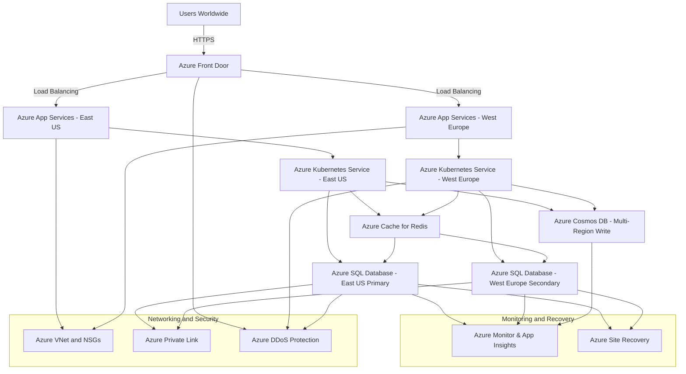

# Azure-Cloud-Architect-Knowledge-Based-

### **1. How do you approach translating business requirements into a scalable and cost-effective Azure solution?**
Translating business requirements into a scalable and cost-effective Azure solution involves a structured approach that aligns cloud architecture with business objectives, technical constraints, and operational needs. Here's an expanded explanation of how to approach this process:

### **Approach to Translating Business Requirements into an Azure Solution**

1. **Requirement Gathering and Analysis:**
   - **Understand Business Objectives:** Begin by engaging with stakeholders to understand the core business objectives. Are they looking to reduce costs, increase scalability, enhance performance, improve security, or all of these? Clarify the expected outcomes and KPIs (Key Performance Indicators) to measure success.
   - **Conduct Workshops and Interviews:** Conduct detailed workshops and interviews with business leaders, technical teams, and end-users to gather functional and non-functional requirements. This includes understanding user personas, workflows, data sensitivity, compliance requirements, and the expected growth of users and data.
   - **Identify Constraints and Assumptions:** Document constraints (e.g., budget limits, legacy system dependencies) and assumptions (e.g., expected user growth, transaction volumes) that will impact the solution design.

2. **Define Key Solution Characteristics:**
   - **Performance Requirements:** Determine what performance metrics are critical, such as response time, throughput, and data processing speeds. Use these metrics to select the appropriate Azure services that can meet these performance needs.
   - **Scalability Needs:** Understand both vertical (scale-up) and horizontal (scale-out) scalability requirements. Identify if the application needs to scale automatically based on demand (e.g., using Azure Autoscale for Virtual Machines or Azure Kubernetes Service).
   - **Cost Considerations:** Estimate the total cost of ownership (TCO) by analyzing potential Azure services and resources. Consider compute, storage, network, and operational costs. Look for services that offer flexibility, such as reserved instances, spot VMs, or serverless options that can optimize cost based on workload patterns.
   - **Security and Compliance:** Address any industry-specific compliance needs (e.g., GDPR, HIPAA) and ensure that data encryption, access control, and monitoring are part of the design. Azure services like Azure Key Vault, Azure Policy, and Azure Security Center can be leveraged to enforce security and compliance.
   - **Availability and Resilience:** Define availability requirements, such as SLAs and RPO/RTO (Recovery Point Objective/Recovery Time Objective) for disaster recovery. Use Azure services like Azure Site Recovery, Availability Zones, and Geo-Replication to achieve high availability and resilience.

3. **Choose the Right Azure Services and Architecture Patterns:**
   - **Evaluate Azure Services:** Based on the defined requirements, evaluate which Azure services best meet the needs. For example, choose between Azure App Service, Azure Functions, and Azure Kubernetes Service for hosting applications based on factors like scalability, cost, and management overhead.
   - **Select Architecture Patterns:** Use architecture patterns like microservices, serverless, event-driven, or monolithic based on the application requirements. For example, a highly dynamic, scalable, and loosely-coupled application might benefit from a microservices architecture using Azure Kubernetes Service (AKS) or Azure Functions.
   - **Reference Architectures:** Leverage Azure's Reference Architectures from the Azure Architecture Center to guide the solution design. These references provide best practices for designing secure, high-performing, and cost-effective architectures.
   
4. **Design the Solution Architecture:**
   - **Create Architecture Diagrams:** Develop high-level architecture diagrams that outline the major components and their interactions. Include details on networking, data flow, compute resources, storage solutions, and security layers.
   - **Detailed Design Components:** Break down the high-level architecture into detailed designs for each component, such as API management, data storage, authentication, and integration points.
   - **Consider Multi-Region and Multi-Availability Zone Deployments:** For critical applications requiring high availability and low latency, consider deploying resources across multiple Azure regions and leveraging services like Azure Traffic Manager and Azure Front Door for traffic routing and load balancing.

5. **Optimize for Cost and Efficiency:**
   - **Right-Size Resources:** Use Azure Cost Management and Azure Advisor to analyze and right-size resources, ensuring the solution remains cost-effective without compromising performance.
   - **Serverless and Consumption-Based Models:** Consider serverless options like Azure Functions and Logic Apps where workloads are event-driven or have unpredictable patterns. This can significantly reduce costs since you only pay for what you use.
   - **Reserved Instances and Spot VMs:** For predictable workloads, leverage reserved instances for Virtual Machines (VMs) to gain cost savings over pay-as-you-go pricing. Use spot VMs for non-critical, interruptible workloads to further optimize costs.

6. **Implement DevOps Practices:**
   - **Infrastructure as Code (IaC):** Use tools like Azure Resource Manager (ARM) templates, Bicep, or Terraform to define and manage infrastructure as code. This ensures consistent deployments across environments and makes the infrastructure easily replicable.
   - **CI/CD Pipeline Setup:** Set up CI/CD pipelines using Azure DevOps or GitHub Actions to automate the deployment process, enabling quick iterations, testing, and delivery. This reduces time-to-market and helps in maintaining code quality and consistency.

7. **Develop a Proof of Concept (PoC):**
   - **Build a Prototype:** Develop a PoC to validate the architecture, assess the performance, and understand potential challenges. This helps in fine-tuning the design before full-scale implementation.
   - **Collect Feedback:** Gather feedback from stakeholders, technical teams, and end-users on the PoC to ensure it meets expectations and make adjustments as needed.

8. **Implement Monitoring, Logging, and Management:**
   - **Monitoring and Observability:** Set up monitoring using Azure Monitor, Application Insights, and Log Analytics to ensure the solution operates as expected. Implement alerts for critical metrics to proactively manage issues.
   - **Management and Governance:** Use Azure Policy, Azure Blueprints, and Azure Management Groups to enforce governance and maintain compliance across the Azure environment.

9. **Create Documentation and Training Materials:**
   - **Documentation:** Provide detailed documentation for architecture, configuration, operational procedures, and disaster recovery plans to ensure smooth handover to the operations team.
   - **Training:** Conduct training sessions for the client's technical teams to familiarize them with the new Azure environment, tools, and best practices.

10. **Continuous Improvement:**
    - **Regular Review and Optimization:** Continuously monitor and review the solution post-implementation, leveraging tools like Azure Advisor and Azure Cost Management to identify potential optimizations in performance, security, and cost.

### **Example Use Case: Building a Scalable E-Commerce Platform**

1. **Business Requirement:** An e-commerce company wants to build a new platform that can scale during peak shopping seasons, is secure, and cost-effective, and provides high availability.
   
2. **Proposed Azure Solution:**
   - **Web Front End:** Use Azure App Service with autoscaling enabled for the web front end to handle variable traffic loads.
   - **Data Storage:** Utilize Azure SQL Database with geo-replication for transactional data and Azure Cosmos DB for high-speed, globally distributed NoSQL data.
   - **Caching Layer:** Implement Azure Cache for Redis to improve application performance by caching frequently accessed data.
   - **Data Analytics:** Use Azure Synapse Analytics for real-time data processing and analytics to provide insights into customer behavior and sales trends.
   - **Security and Compliance:** Azure Key Vault for secrets management, Azure Security Center for monitoring and threat detection, and Azure Policy for compliance enforcement.
   - **Monitoring and Management:** Use Azure Monitor, Application Insights, and Log Analytics for complete observability.

3. **Outcome:** The architecture is designed to be scalable, secure, and cost-effective, capable of handling peak loads with minimal downtime and reduced operational costs.

By following this structured approach, you can effectively translate business requirements into a scalable, secure, and cost-effective Azure solution that meets both current and future business needs.

### **2. Can you describe a time when you had to design an Azure architecture to meet strict performance and reliability requirements?**

Designing an Azure architecture to meet strict performance and reliability requirements involves careful planning, selecting appropriate Azure services, and implementing best practices to ensure high availability, low latency, and fault tolerance. This often includes leveraging Azure’s built-in capabilities for scalability, redundancy, and disaster recovery.

### **Approach to Designing an Azure Architecture for Performance and Reliability**

When designing such an architecture, the following steps are typically involved:

1. **Understand Requirements:**
   - **Performance Requirements:** Determine the performance metrics such as response times, transaction throughput, and latency requirements. Understand the expected load and peak traffic patterns.
   - **Reliability Requirements:** Define SLAs (Service Level Agreements), availability targets (e.g., 99.9% uptime), and disaster recovery objectives (RPO - Recovery Point Objective, RTO - Recovery Time Objective).

2. **Choose the Right Azure Services:**
   - Select Azure services that provide the required performance and reliability, such as Azure SQL Database with geo-replication, Azure Virtual Machines with Availability Sets or Availability Zones, and Azure Front Door or Traffic Manager for global load balancing.

3. **Design for High Availability and Fault Tolerance:**
   - Implement redundancy at all levels (compute, network, data, etc.) to avoid single points of failure.
   - Use multiple Availability Zones and Regions for critical workloads to ensure resiliency.

4. **Implement Scalability and Performance Optimization:**
   - Use Azure Autoscale, Azure Load Balancer, and Azure Cache for Redis to handle variable workloads and optimize performance.
   - Optimize data storage and retrieval using caching strategies, read replicas, and appropriate indexing.

5. **Ensure Security and Compliance:**
   - Incorporate security best practices, such as using Azure Key Vault for secrets management, Azure DDoS Protection, and network security controls like NSGs and ASGs.

6. **Monitor and Optimize Continuously:**
   - Implement Azure Monitor, Azure Application Insights, and Azure Log Analytics for monitoring, alerting, and optimizing the performance and reliability of the architecture.

### **Use Case: High-Performance and Reliable E-Commerce Platform**

**Scenario:**
A global e-commerce company wants to build a highly reliable and performant platform on Azure to support millions of users worldwide. The platform must handle peak loads during seasonal sales, ensure data integrity, provide high availability, and meet an SLA of 99.99%.

#### **Key Requirements:**
- **Performance:** The platform must handle thousands of concurrent transactions with low latency (under 200 ms response time).
- **Reliability:** Must have a multi-region deployment with an SLA of 99.99%.
- **Scalability:** Automatic scaling to handle traffic spikes during sales events.
- **Security:** Secure data handling and compliance with GDPR and other regulatory standards.
- **Disaster Recovery:** RPO of 15 minutes and RTO of 30 minutes.

#### **Architecture Design:**

1. **Frontend Layer:**
   - **Azure Front Door:** Used for global load balancing, SSL offloading, and fast content delivery. It directs user traffic to the nearest backend region and provides application layer security with WAF (Web Application Firewall).
   - **Azure CDN (Content Delivery Network):** For caching static content to reduce latency and offload traffic from the web servers.

2. **Application Layer:**
   - **Azure App Services (Web Apps):** Deployed in multiple regions (East US and West Europe) for hosting the e-commerce web application. The web apps are configured with autoscaling to handle traffic surges.
   - **Azure Kubernetes Service (AKS):** Hosts microservices for business logic with autoscaling and self-healing capabilities. AKS clusters are deployed in different regions with cluster autoscaling enabled.

3. **Data Layer:**
   - **Azure SQL Database with Geo-Replication:** Provides a managed relational database service with read replicas in secondary regions for high availability and disaster recovery.
   - **Azure Cosmos DB:** For globally distributed, low-latency NoSQL data storage with multi-region write capabilities.
   - **Azure Cache for Redis:** Provides in-memory caching to reduce database load and improve read performance.

4. **Networking and Security:**
   - **Azure Virtual Network (VNet):** Segregates the application, data, and management subnets with Network Security Groups (NSGs) to control traffic flow.
   - **Azure Private Link:** Used for secure connections between services within the Azure network.
   - **Azure DDoS Protection Standard:** Provides enhanced DDoS mitigation features to protect the application from volumetric attacks.

5. **Monitoring and Incident Management:**
   - **Azure Monitor and Application Insights:** For end-to-end monitoring, logging, and telemetry of application performance and availability.
   - **Azure Log Analytics:** Centralized logging and query capabilities for proactive monitoring and troubleshooting.

6. **Backup and Disaster Recovery:**
   - **Azure Site Recovery:** Configured for orchestrating failover between regions, ensuring an RTO of 30 minutes.
   - **Automated Backups:** Regular backups are configured for both Azure SQL Database and Azure Cosmos DB to ensure data availability with an RPO of 15 minutes.

#### **Mermaid Diagram for the High-Performance and Reliable E-Commerce Platform:**



### **Key Components in the Diagram:**

- **Users Worldwide:** Represents end-users accessing the e-commerce platform globally.
- **Azure Front Door:** Provides global load balancing, SSL offloading, WAF protection, and traffic routing to the nearest Azure region.
- **Azure App Services (East US, West Europe):** The front-end layer of the e-commerce platform hosted on Azure App Services with autoscaling.
- **Azure Kubernetes Service (East US, West Europe):** Manages the microservices architecture for business logic processing with autoscaling.
- **Azure SQL Database with Geo-Replication:** Ensures data availability and redundancy across regions for the relational database.
- **Azure Cosmos DB:** Provides globally distributed NoSQL data storage with low-latency and high-availability guarantees.
- **Azure Cache for Redis:** In-memory caching layer for improved read performance and reduced load on the SQL Database.
- **Networking and Security:** Azure VNet for network isolation, NSGs for traffic control, Private Link for secure service connectivity, and DDoS Protection for enhanced security.
- **Monitoring and Recovery:** Azure Monitor and Application Insights for observability and alerting, and Azure Site Recovery for orchestrating disaster recovery.

### **Outcome:**

By implementing this Azure architecture, the e-commerce platform can meet the strict performance and reliability requirements:

- **High Availability:** Achieved through multi-region deployment, geo-replication, and redundancy across all layers.
- **Scalability:** Auto-scaling capabilities in Azure App Services and AKS allow the platform to handle traffic spikes seamlessly.
- **Performance:** Low-latency global load balancing with Azure Front Door and fast data access using Azure Cache for Redis and Cosmos DB.
- **Security and Compliance:** Enhanced security with Azure DDoS Protection, Private Link, NSGs, and compliance with regulatory standards.
- **Disaster Recovery:** Meets RPO and RTO targets using Azure Site Recovery and automated backups.

This architecture ensures that the platform is resilient, scalable, and performant, capable of handling millions of users globally with a reliable and secure cloud foundation.


### **3. How do you ensure that your Azure solutions adhere to best practices in security?**
Ensuring that Azure solutions adhere to **best practices in security** involves implementing a comprehensive, multi-layered security approach to protect resources, data, and applications from potential threats. This approach is often called **defense-in-depth**, where security controls are layered to provide redundancy in the event of a failure or breach at any one level. Below is an expanded discussion on how to achieve this, followed by a use case and a corresponding Mermaid diagram.

### **Approach to Ensuring Security Best Practices in Azure Solutions**

To ensure that Azure solutions adhere to best practices in security, the following key strategies should be implemented:

1. **Identity and Access Management (IAM):**
   - Use **Azure Active Directory (Azure AD)** for centralized identity management and single sign-on (SSO) across Azure and third-party applications.
   - Implement **Multi-Factor Authentication (MFA)** for all users, especially for privileged accounts, to add an additional layer of security.
   - Utilize **Role-Based Access Control (RBAC)** to grant the least privilege necessary for users and services, ensuring that only authorized personnel have access to sensitive resources.
   - Enable **Privileged Identity Management (PIM)** to manage, control, and monitor access to important resources in Azure AD and Azure.

2. **Network Security:**
   - **Network Security Groups (NSGs)**: Control inbound and outbound traffic to Azure resources within a Virtual Network (VNet).
   - **Azure Firewall**: Implement a stateful firewall to provide centralized network security policies and log all traffic.
   - **Web Application Firewall (WAF)**: Protect web applications from common web vulnerabilities, such as SQL injection and cross-site scripting (XSS).
   - **Virtual Network Service Endpoints** and **Private Link**: Securely extend your network to Azure services, keeping traffic on the Azure backbone.

3. **Data Security:**
   - **Encryption**: Ensure data is encrypted at rest and in transit using **Azure Storage Service Encryption (SSE)**, **Transparent Data Encryption (TDE)** for Azure SQL Database, and **Azure Disk Encryption** for VMs.
   - Use **Azure Key Vault** to manage secrets, encryption keys, and certificates securely, ensuring data remains protected.
   - Implement **Data Loss Prevention (DLP)** and **Azure Information Protection** to classify, label, and protect sensitive data.

4. **Application Security:**
   - **Secure DevOps** practices: Integrate security early in the development lifecycle with tools like **Azure DevOps** and **GitHub Actions** for CI/CD.
   - Use **Managed Identities** for Azure resources to avoid embedding credentials in code and to securely authenticate against Azure services.
   - Conduct regular vulnerability assessments and penetration testing using **Azure Security Center** and integrate security scans into CI/CD pipelines.

5. **Monitoring and Incident Response:**
   - **Azure Monitor**, **Azure Sentinel**, and **Azure Security Center**: Implement these for continuous monitoring, threat detection, incident response, and compliance management.
   - Automate incident response using **Azure Logic Apps**, **Azure Automation**, or **Azure Functions** to reduce response times to security events.

6. **Governance and Compliance:**
   - **Azure Policy**: Enforce organizational policies and compliance requirements across all resources, ensuring resources are configured consistently and securely.
   - **Azure Blueprints**: Deploy a set of Azure resources that adhere to your organization’s standards, patterns, and requirements in a repeatable manner.
   - **Azure Resource Locks**: Prevent accidental deletion or modification of critical resources by implementing read-only or delete locks.

### **Use Case: Securing a Multi-Cloud Application on Azure**

**Scenario:**
A healthcare organization needs to deploy a multi-cloud patient management application that adheres to strict security and compliance requirements, such as HIPAA in the United States. The application must securely handle sensitive patient data, ensure high availability, and be resilient against potential cyber-attacks.

#### **Key Security Requirements:**
- **Data Protection:** All sensitive patient data must be encrypted both at rest and in transit.
- **Access Control:** Only authorized personnel and applications should have access to sensitive resources.
- **Compliance:** The solution must comply with HIPAA regulations, which require strong access controls, auditing, and data protection.
- **Incident Response:** The organization must have capabilities for detecting and responding to security threats in real time.

#### **Azure Security Solution Design:**

1. **Identity and Access Management (IAM):**
   - **Azure Active Directory (Azure AD):** Set up centralized identity management with Azure AD. All users and applications authenticate using Azure AD. Implement **Conditional Access Policies** to enforce MFA, restrict access based on location or risk, and ensure compliance with security requirements.
   - **Role-Based Access Control (RBAC):** Use RBAC to limit access to Azure resources based on user roles (e.g., doctors, nurses, administrators) and apply the principle of least privilege.
   - **Privileged Identity Management (PIM):** Implement PIM to provide just-in-time access for privileged roles, with automatic logging and alerting on all elevated access activities.

2. **Network Security:**
   - **Virtual Network (VNet) Segmentation:** Deploy the application components in a segmented VNet structure:
     - **Web Subnet:** Hosts the front-end web application behind an **Azure Application Gateway** with **WAF** enabled.
     - **API Subnet:** Hosts the middle-tier API services that only accept traffic from the Web Subnet.
     - **Database Subnet:** Hosts the backend Azure SQL Database and Cosmos DB instances, accessible only by the API subnet.
   - **Azure Firewall:** A centralized Azure Firewall is deployed to manage and monitor all traffic flowing between the subnets and to and from the internet.
   - **Private Link and Service Endpoints:** Secure access to Azure services (like Azure SQL Database and Azure Storage) using Private Link, keeping traffic within the Azure backbone network.

3. **Data Security:**
   - **Transparent Data Encryption (TDE):** Enabled for Azure SQL Database to encrypt data at rest automatically.
   - **Azure Key Vault:** Used for managing secrets, certificates, and encryption keys. Keys are rotated regularly, and access is tightly controlled using Azure AD identities and RBAC.
   - **Data Loss Prevention (DLP):** Configured to detect, monitor, and protect sensitive information from unauthorized access or sharing.

4. **Application Security:**
   - **Managed Identities:** The application uses **Managed Identities** to access Azure resources like Key Vault and Azure SQL Database, eliminating the need for storing credentials in the codebase.
   - **Secure DevOps Practices:** Integrated **Azure DevOps** pipelines with security checks and code scanning tools (like **SonarQube** or **Checkmarx**) to ensure vulnerabilities are identified and mitigated early in the development lifecycle.

5. **Monitoring and Incident Response:**
   - **Azure Security Center and Azure Sentinel:** Implement these for continuous security posture monitoring, vulnerability assessment, and advanced threat detection with AI and machine learning capabilities.
   - **Automated Response:** Use **Azure Logic Apps** to automate incident response workflows, such as isolating a compromised VM or revoking access from a potentially compromised user account.

6. **Governance and Compliance:**
   - **Azure Policy and Blueprints:** Deploy **Azure Blueprints** tailored for HIPAA compliance, which includes required policies, role assignments, and resource configurations.
   - **Resource Locks:** Critical resources like Azure SQL Database and Key Vault are protected with delete locks to prevent accidental deletion.

#### **Mermaid Diagram for the Secured Multi-Cloud Healthcare Application Architecture:**

Here’s a Mermaid diagram to illustrate the security architecture:

```mermaid
graph TD;
  A[Users] -->|HTTPS| B[Azure Application Gateway with WAF]
  B --> |HTTPS| C[Web Tier: Azure App Services]
  C --> |HTTPS| D[API Tier: Azure API Management]
  D --> |Private-Link| E[Database Tier: Azure SQL Database]
  D --> |Private-Link| F[NoSQL Tier: Azure Cosmos DB]
  
  subgraph VNet Segmentation
    C
    D
    E
    F
  end
  
  subgraph Network Security
    G[Azure-Firewall]
    H[NSG-Web-Tier]
    I[NSG-API-Tier]
    J[NSG-Database-Tier]
  end
  
  B --> G
  C --> H
  D --> I
  E --> J
  
  subgraph Data Security
    K[Azure-Key-Vault]
    L[Transparent-Data-Encryption-(TDE)]
    M[Data-Loss-Prevention-(DLP)]
  end
  
  E --> L
  F --> L
  C --> K
  D --> K
  E --> K
  
  subgraph Monitoring and Response
    N[Azure Security Center]
    O[Azure Sentinel]
    P[Automated Response with Logic Apps]
  end
  
  G --> N
  H --> N
  I --> N
  J --> N
  N --> O
  O --> P
```

### **Key Components in the Diagram:**

- **Users:** Represent end-users accessing the patient management application.
- **Azure Application Gateway with WAF:** Provides web application firewall protection and SSL offloading for incoming HTTPS traffic.
- **Web Tier (Azure App Services):** Hosts the front-end web application within a segmented VNet.
- **API Tier (Azure API Management):** Manages API access, rate limiting, and caching for back-end services.
- **Database Tier (Azure SQL Database):** Stores sensitive patient data securely with encryption and private link connectivity.
- **NoSQL Tier (Azure Cosmos DB):** Stores unstructured data with globally distributed capabilities.
- **Network Security:** Azure Firewall and NSGs to manage and monitor network traffic between subnets.
- **Data Security:** Azure Key Vault for managing secrets, Transparent Data

 Encryption (TDE) for encrypting data at rest, and Data Loss Prevention (DLP) to protect sensitive data.
- **Monitoring and Response:** Azure Security Center, Azure Sentinel for advanced threat detection, and automated incident response using Logic Apps.

### **Outcome:**

By implementing this comprehensive Azure architecture with a strong focus on security best practices, the healthcare organization ensures:

- **Data Security and Compliance:** Meets stringent HIPAA requirements for data encryption, access control, and auditing.
- **Identity and Access Management:** Centralized and secure identity management with Azure AD, MFA, RBAC, and PIM.
- **Network Security:** Robust network segmentation, traffic filtering, and protection against web-based attacks.
- **Threat Detection and Response:** Real-time monitoring, automated threat detection, and incident response to minimize risks.
- **Operational Efficiency:** Secure DevOps practices and automation reduce manual intervention and improve deployment consistency.

This architecture demonstrates how Azure’s security services and best practices can be leveraged to build a secure, compliant, and robust cloud solution for handling sensitive data in regulated industries.
### **4. Can you walk us through how you would develop architecture blueprints and documentation for a new Azure project?**
   **Answer:** 
   - **Approach:** Start by creating a high-level architecture diagram to capture the overall system design. Break this down into detailed diagrams for each component, such as networking, data storage, and compute. Use tools like Microsoft Visio or Azure Architecture Center for this. Accompany diagrams with documentation that explains the rationale behind each architectural decision, assumptions made, and how the design meets the business requirements.
   - **Use Case:** For a microservices-based application, create diagrams that detail the interactions between services, data flow, and deployment models. Document how Azure Kubernetes Service (AKS) is used to manage the microservices, how traffic is routed through Azure API Management, and how Azure Monitor is set up for logging and monitoring.

### **5. How do you approach code reviews and performance optimizations in Azure-based projects?**
   **Answer:** 
   - **Approach:** Implement code reviews as a regular part of the development process, using tools like Azure DevOps or GitHub to facilitate collaboration. Focus on best practices for scalability, security, and efficiency. Use Azure Monitor and Application Insights to identify performance bottlenecks and recommend optimizations, such as caching strategies, query optimizations, or resource scaling.
   - **Use Case:** In an e-commerce platform, after reviewing the code, you may identify a slow-performing query in Azure SQL Database. You could optimize it by indexing, leading to faster transaction processing and a better user experience.

### **6. How do you stay updated on the latest Azure offerings and how do you evaluate their applicability to your projects?**
   **Answer:** 
   - **Approach:** Regularly attend Azure webinars, follow Azure blogs, participate in the Azure community, and take part in hands-on labs. Evaluate new offerings by considering their maturity, compatibility with existing systems, and the specific needs of your current or future projects.
   - **Use Case:** When Azure Functions Premium Plan was introduced, you might have evaluated its benefits for a project that needed better scaling options and a dedicated compute environment for a serverless application.

### **7. Can you describe your experience working with DevOps, security, and operations teams to integrate Azure solutions?**
   **Answer:** 
   - **Example:** Collaborated with DevOps teams to set up CI/CD pipelines using Azure DevOps, ensuring automated deployments and testing. Worked with security teams to enforce compliance by integrating Azure Policy and Azure Blueprints. Coordinated with operations teams to ensure smooth deployment and monitoring of Azure resources.
   - **Use Case:** For a large-scale application, you set up a CI/CD pipeline in Azure DevOps that automated the deployment of a microservices architecture on AKS, ensuring that security checks and compliance policies were enforced before each deployment.

These questions and answers should give you a strong foundation to demonstrate your expertise in Azure architecture and solution design during interviews.
